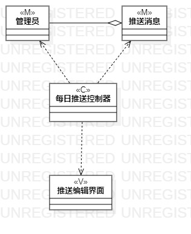
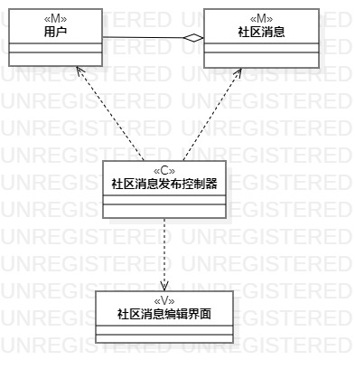

# 实验四、五

## 一、实验目标

1. 掌握类建模方法
2. 了解MVC设计模式
3. 理解类的5种关系
4. 掌握类图(Class Diagram)的画法

## 二、实验内容

1. 观看教学视频，学习类建模知识
2. 基于MVC模式设计类
3. 设计类的关系
4. 根据类的关系画出类图

## 三、实验步骤

1. 观看老师的教学视频学习类图的画法
2. 从用例规约中的基本流程和扩展流程中寻找类
3. 根据类之间的关系用线连接各个类
    - 依赖Dependency（虚线箭头）
    - 关联Association（实线）
    - 聚合Aggregation（实线空心棱形）
    - 组合Composition（实线实心棱形）
    - 继承Inheritance（实线空心三角形）
4. 绘制完类图后命名保存
5. 撰写实验报告

## 四、实验结果
 

  
图1. 每日推送的类图  

  
图2. 发布社区消息的类图  
