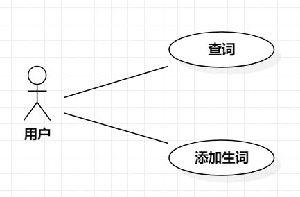

# 实验二：用例建模

## 一、 实验目标

1. 学会使用Markdown编写实验报告 
2. 学会使用StarUML绘制用例图
3. 学会编写用例规约 

## 二、 实验内容

1. 细化系统功能
2. 绘制用例图 
3. 编写用例规约 

## 三、 实验步骤

1. 细化系统功能  
    1）查词：查询某个单词的（英语、日语、法语等）翻译  
    2）添加生词：将查到的单词添加到用户生词本中
2. 确定参与者：用户
3. 添加用例：查词、添加生词
4. 建立参与者与用例之间的联系
5. 绘制用例图
6. 编写用例规约

## 4. 实验结果

图1：翻译系统的用例图

## 表1：查词用例规约  

用例编号  | UC01 | 备注  
-|:-|-  
用例名称  | 查词  |     
前置条件  | 用户进入翻译系统首页 |   
后置条件  |      |   
基本流程  | 1. 用户选择源语言和目标语言的语种；|      
~| 2. 用户输入单词，点击翻译按钮；  |     
~| 3. 系统检查输入非空，查询单词的对应翻译；  |     
~| 4. 系统显示单词翻译结果。  |     
扩展流程  | 3.1 系统检查输入为空，提示“输入不能为空”。  |  

## 表2：添加生词用例规约  

用例编号  | UC02 | 备注 
-|:-|-  
用例名称  | 添加生词  |   
前置条件  | 用户查词成功     |   
后置条件  |      |   
基本流程  | 1. 用户点击添加按钮；|
~| 2. 系统查询用户生词本，检查未存在相同生词，保存生词； |      
~| 3. 系统显示“添加成功”。 |  
扩展流程  | 2.1 系统检查到生词已存在用户生词本中，提示“生词已保存，请勿重复添加”。  | 

