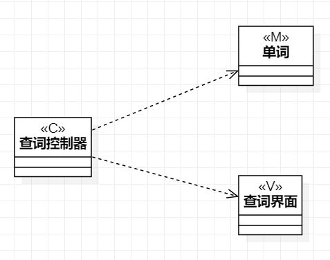

# 实验四五：类建模
## 一、实验目标
1. 掌握类建模方法
2. 了解MVC或你熟悉的设计模式
3. 掌握类图的画法
4. 理解类的5种关系；
5. 掌握类之间关系的画法。

## 二、实验内容
1. 根据MVC模式设计类
2. 绘制类图

## 三、实验步骤
1. 根据用例规约确定每个用例需要建立哪些类  
2. 绘制类图  
   查词用例：查词控制器(C)、单词(M)、查词页面(V)  
   添加生词用例：添加生词控制器(C)、单词(M)、添加生词页面(V)  
3. 确定类之间的关系，连接各个类图  

## 四、实验结果
  
图1：查词的类图  
  
图2：添加生词的类图

## 五、课堂笔记
1.  类的描述包括状态和行为（属性和操作），在UML中类图用矩形表示，矩形=名称+属性+操作
2.  类的可见性：public、private、protected、package
3.  类之间的关系有：  
    依赖Dependency（类间关系弱。类间关系越弱越好，这样容易修改）  
    关联Association  
    聚合Aggregation  
    组合Composition  
    继承Inheritance（类间关系强）
4.  MVC设计模式：  
    Model：模型、实体、业务数据  
    View：视图、界面  
    Controller：控制器、系统、Service  
