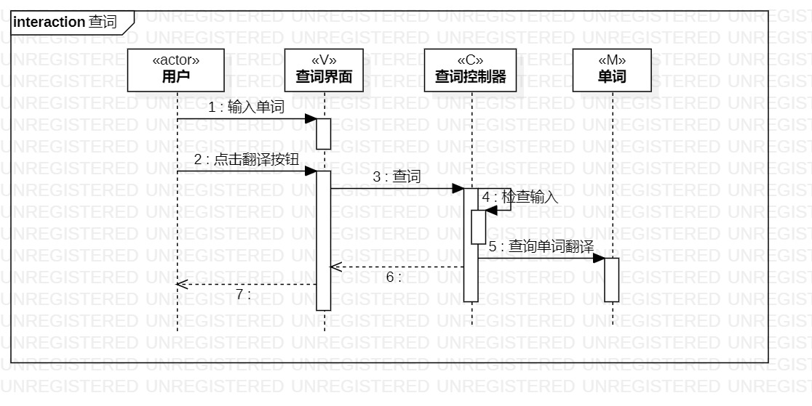
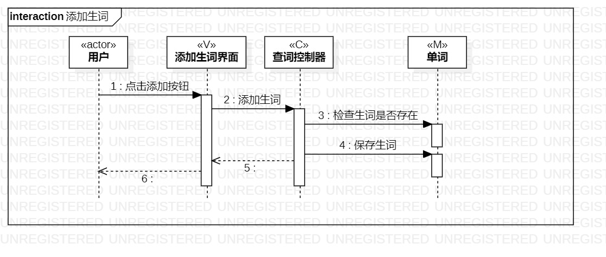

# 实验六：交互建模
## 一、实验目标
1. 理解系统交互；
2. 掌握UML顺序图的画法；
3. 掌握对象交互的定义与建模方法。

## 二、实验步骤
1. 从用例图中找到参与者  
2. 从类图中找到其他N个参与者（N+1）  
3. 从活动图中找到操作步骤  
4. 按时间顺序（从上到下）画出参与者之间的消息

## 三、实验结果
  
图1：查词的顺序图  
  
图2：添加生词的顺序图

## 四、课堂笔记
1.  对象是类的实例，在给对象命名时首字母经常是小写的，给类命名时首字母大写
2.  消息即某一个操作或类里面的某一个方法，消息=事件=信号
3.  uml中消息的使用分类：同步消息（常用），异步消息，返回消息，参与者创建消息，消除消息
4.  顺序图：描述参与者与系统的交互
