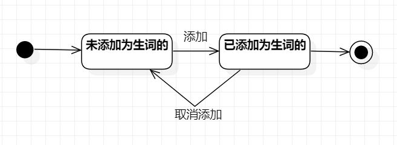

# 实验六：状态建模
## 一、实验目标
1. 掌握对象状态建模

## 二、实验步骤
1. 找到一个对系统来说最重要的对象：单词    
2. 找到该对象的所有最重要的状态：未添加为生词的，已添加为生词的  
3. 画出各状态之间的转变条件：添加，取消添加   

## 三、实验结果
  
图1：单词的状态图  

## 四、课堂笔记  
1. 对象的状态指的是对象所包含的所有数据  
2. 一般在描述对象的状态的时候使用限定词（形容词）
3. 一个对象对应一个状态图
4. 状态成立的前提条件是状态的描述对象已存在在内存中
