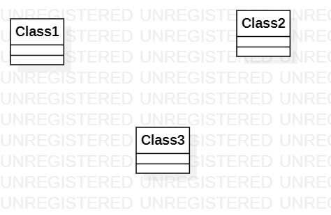

# 实验一

## 一. 实验目标

1. 熟悉github实验过程
2. 安装与使用StarUML

## 二. 实验内容

1. 安装github联系使用git bash
2. 安装StarUML并创建一个图

## 三. 实验步骤

1. 安装工具软件
2. fork项目到账号下
3. clone项目到本地磁盘
4. 用StarUML创建第一个图
5. 将图片pull到github库中
6. 执行pullrequest
7. 编写实验报告

## 四. 实验结果

1.画图 
  
图1.在StarUML创建的第一个图
