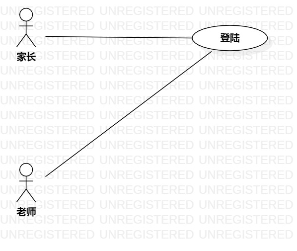

# 实验二

## 一. 实验目标

- 学会使用StarUML用例建模

## 二. 实验内容

- 细化功能需求。
- 画出用例图（Use Case Diagram）。
- 编写用例规约（表格）

## 三. 实验步骤

- 创建更新issue#355
- 画图：用例图图2（老师发布个人简介）、图3（家长筛选老师）
- 编写用例规约表2（发布信息用例规约），表3（筛选配对老师用例规约）
        
## 四. 实验结果

- 用例图1
  
图1.老师发布个人简介

- 用例图2
  
图2.家长筛选配对老师

## 表1：发布个人简介用例规约
用例编号  | UC02 | 备注 
-|:-|-  
用例名称  | 发布个人信息  |  
前置条件  | 老师登入系统  | *可选*  
后置条件  |   | *可选*  
基本流程  | 1. 老师点击发布信息按钮  |  
~| 2. 老师输入个人简介（教龄，年龄，年级科目及经验），点击确认发布按钮  |
~| 3. 系统检查到输入框**不为空**  |
~| 4. 保存个人简介，提示发布成功  |
~| 5. 显示已发布的消息  |
扩展流程  | 3.1 系统检测到输入框为空，提示**输入框不能为空**  | *用例执行失败*  
~| 4.1 系统出错或网络断开，系统提示**发布失败** |

## 表2：筛选配对老师用例规约
用例编号  | UC03 | 备注 
-|:-|-  
用例名称  | 筛选配对老师  |  
前置条件  | 老师发布个人简介  | *可选*  
后置条件  |  | *可选*  
基本流程  | 1. 家长浏览老师发布的个人简介  |  
~| 2. 家长满意，点击配对按钮  |
~| 3. 系统检测内容是否存在  |
~| 4. 系统检测老师是否已配对  |
~| 5. 系统保存配对信息  |
~| 6. 系统提示**配对成功**  |
~| 7. 显示配对信息  |
扩展流程  | 1.1 系统检测到无老师发布个人简介，提示**暂无老师发布个人简介**  | *用例执行失败*  
~| 3.1 系统检测到该个人简介已被删除，提示**该简介已被发布者删除，请重新筛选** | *用例执行失败* 
~| 4.1 系统检测到该教师已配对，提示**已配对，请重新筛选** | *用例执行失败* 
~| 6.1 系统出错或网络断开，系统提示**配对失败** |
