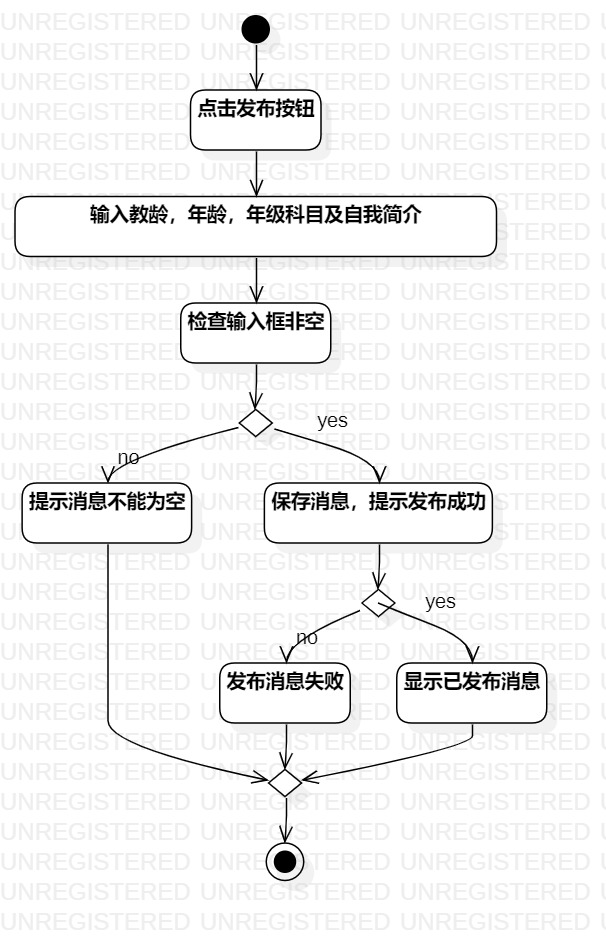
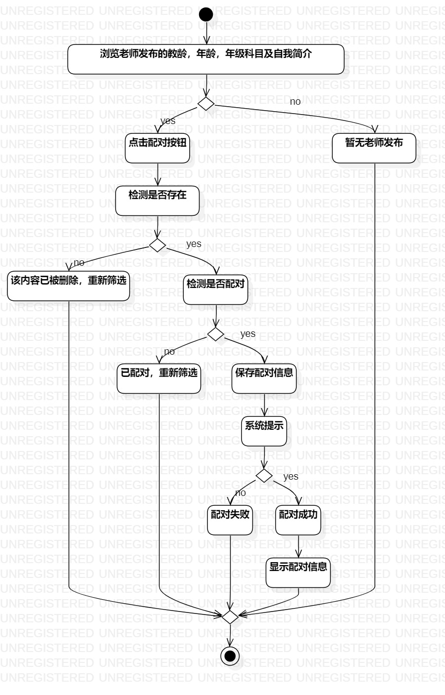

# 实验三：用例建模

### 一、实验目标
    1.掌握过程建模方法
    2.掌握活动图的画法

### 二、实验内容
    1.根据自己的用例规约画出相应的活动图。
    2.熟悉自己的扩展流程，掌握出现分支的操作，如何使用决策（Decision）节点。

 ### 三、实验步骤
     1.根据实验二的用例规约画出相应的活动图
     2.用例规约：1）发布个人简介 2）筛选配对老师  画出活动图，如下图1，2所示
     3.用例规约的Initial点，Action图，决策点和Merge，Final，按流程画出来。
     4.理清需求，再次完善分支操作。
     5.填写好分支条件。
     6.按流程和需求逻辑，用Control Flow连接。

## 四. 实验结果

- 发布个人简介活动图
  
图1.发布个人简介活动图

- 筛选配对老师活动图
  
图2.筛选配对老师活动图

## 五、实验调试
- 实验过程中git报错：error: failed to push some refs to 'https://github.com/laughla/uml-modeling-2020'

- 解决方案参考https://www.cnblogs.com/shuchengyi/p/11937219.html
