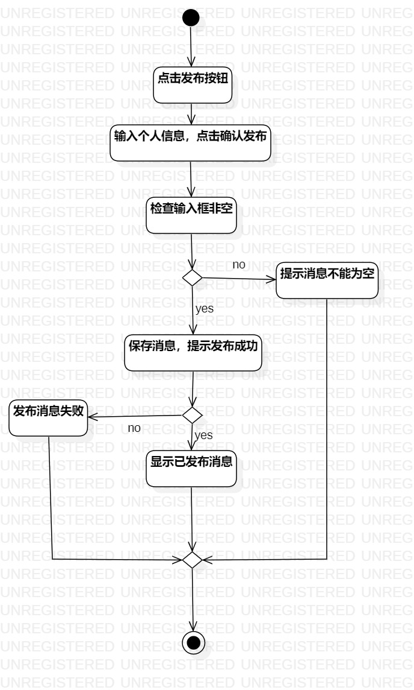
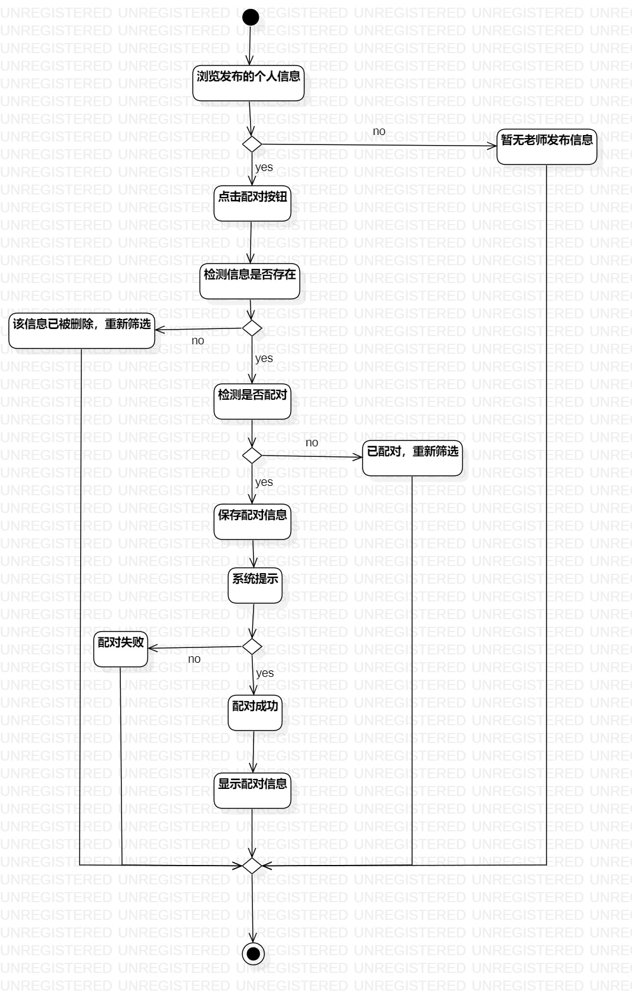

# 实验三

## 一. 实验目标

- 使用STARUML画用例活动图

## 二. 实验内容

## 三. 实验步骤

        
## 四. 实验结果

- 发布信息活动图
  
图1.发布信息活动图

- 筛选配对老师活动图
  
图2.筛选配对老师活动图

## 五、实验调试
- 实验过程中git报错：error: failed to push some refs to 'https://github.com/laughla/uml-modeling-2020'

- 解决方案参考https://www.cnblogs.com/shuchengyi/p/11937219.html
