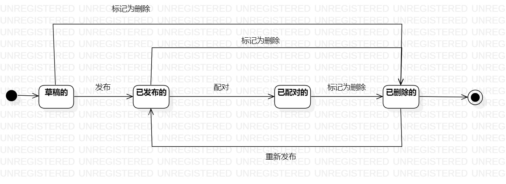

# 实验七：状态建模 

### 一、实验目标
 掌握对象状态建模

### 二、实验内容
  1.观看教学视频
  2.根据用例图、活动图、类图、时序图来绘画状态图  
  3.编写实验报告文档

 ### 三、实验步骤
   1.观看B站教学视频
   2.绘画状态图
     -寻找一个重要的对象   
     -寻找这个对象所有的重要状态  
     -画出状态之间的转变条件 
   3.编写实验报告  

 ### 四、实验结果
    

  图1.老师个人简介状态图
