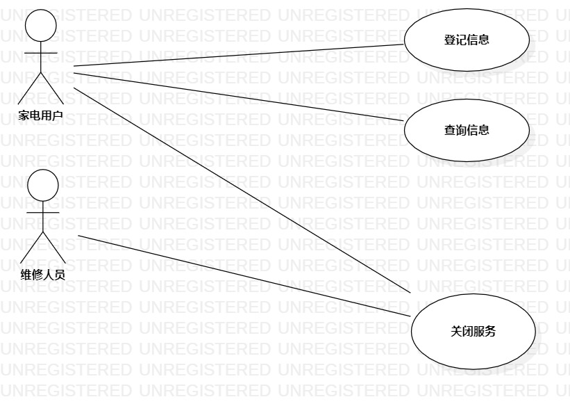

# 实验二：用例建模  

## 一、 实验目标  

1. 细化功能需求
2. 学习使用StarUML用例建模
3. 学习并编写用例规约

## 二、 实验内容  

1. 描述功能点
2. 创建用例图
3. 编写实验报告
4. 编写用例规约

## 三、 实验步骤  

1. 功能点描述
 家电用户-登记维修信息：家电用户登记联系电话、具体地址、家电故障情况。若联系电话为空或具体地址为空则登记失败；否则，生成维修单。维修单包含维修单号、家电用户联系电话（不为空）、具体地址（不为空）、家电故障情况、维修进度、维修单状态（进行中/已结束）、维修人员联系电话、关闭说明（不为空）
 家电用户-查询维修进度：家电用户查询维修人员反馈的维修进度。
 维修人员-关闭维修服务：家电已维修完成/用户联系电话有误，将维修单状态置为已结束。
 家电用户-关闭维修服务：家电用户不需要维修服务，将维修单状态置为已结束。
2. 确定参与者：家电用户、维修人员
3. 确定用例：登记维修信息、关闭维修服务、查询维修进度
6. 绘制用例图并导出为JPEG文件
7. 编写用例规约
8. 编写实验报告

## 四、 实验结果  

 

## 五、用例规约

### 表1:登记信息的用例规约  

用例编号  | UC01 | 备注 
-|:-|-  
用例名称 | 登记维修信息  |   
前置条件 |      |*可选*
后置条件 | 维修单状态为进行中。|*可选*
基本流程 | 1.家电用户输入联系电话、具体地址、家电故障情况。 |  
~| 2.系统检测联系电话和具体地址不为空，生成维修单并匹配维修人员联系电话。 |   
~| 3.系统生成并显示维修单号。 |   
~| 4.系统保存维修单。 |   
~| 5.系统提示登记成功。 | 
扩展流程 | 2.1系统检测联系电话为空，提示输入联系电话。 |*用例执行失败*   
~| 2.2系统检测具体地址为空，提示输入具体地址。|

### 表2:查询信息的用例规约  

用例编号  | UC02 | 备注
-|:-|-  
用例名称  | 查询维修信息 |   
前置条件  |      |*可选*
后置条件  |      |*可选*
基本流程  | 1.家电用户输入联系电话和维修单号。 | *用例执行成功的步骤* 
~| 2.系统检测联系电话和维修单号相匹配。 |
~| 3.系统显示维修单信息。 |   
扩展流程  | 2.1 系统检测联系电话与维修单号不匹配，提示查询失败，请重新输入联系电话与维修单号。 | *用例执行失败* 

### 表3：关闭服务的用例规约  

|用例编号  | UC03 | 备注 |
-|:-|-   
用例名称  | 关闭维修服务  |   
前置条件  | 维修单状态为进行中。 |*可选*
后置条件  |   |*可选* 
基本流程  | 1.维修人员/家电用户输入联系电话与维修单号。 |*用例执行成功的步骤*  
~| 2. 系统检测联系电话和维修单号相匹配。 |  
~| 3. 系统显示维修单信息。 |  
~| 4. 维修人员/家电用户填写关闭说明，并点击关闭按钮。 |  
~| 5. 系统检测关闭说明不为空。 |  
~| 6. 系统保存关闭说明，并将维修单状态置为已结束。 |  
~| 7. 系统保存维修单，并提示已关闭服务。 |  
扩展流程 | 5.1 系统检测关闭说明为空，提示请填写关闭说明。 |*用例执行失败* 

