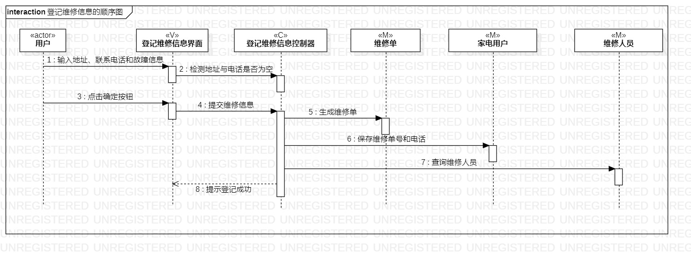
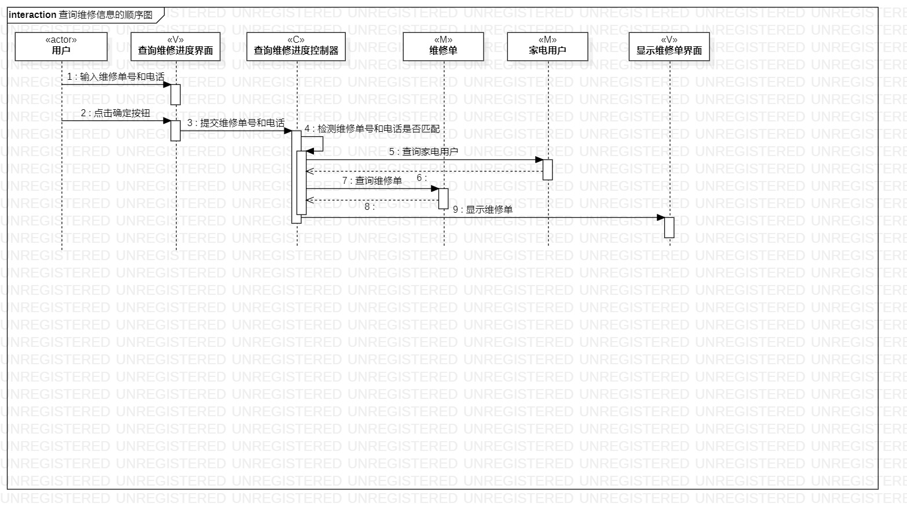
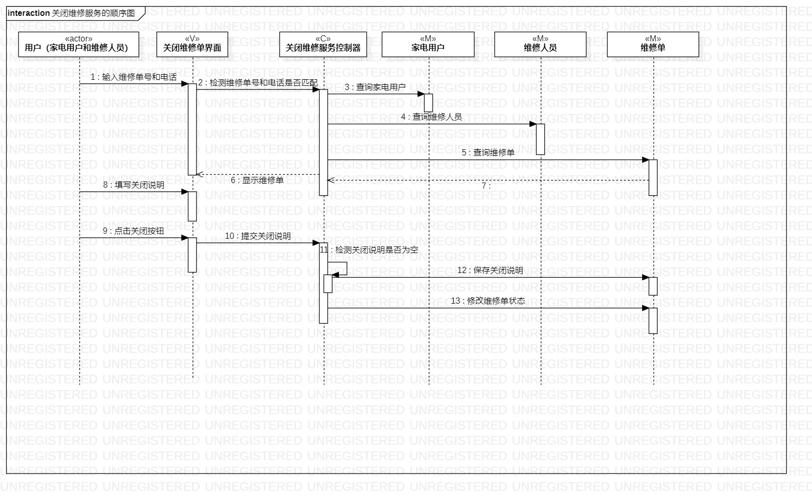

# 实验六：交互建模

## 一、 实验目标  

1. 理解系统交互；
2. 掌握UML顺序图的画法；
3. 掌握对象交互的定义与建模方法。

## 二、 实验内容  

1. 绘制交互图
2. 修改类图
3. 编写实验报告

## 三、 实验步骤  

1. 观看教学视频
2. 修改实验45
3. 绘制交互图
4. 观看问题讲解修改交互图
5. 编写实验报告

## 四、 实验结果  

 
 
 

