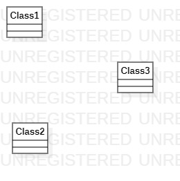

# 实验1

## 一、实验目的
1. 掌握github的使用
2. 熟悉StarUML的使用

## 二、实验内容
1. 下载并安装建模工具StarUML
2. 下载并安装工具git
3. 建立第一个UML模型图

## 三、实验步骤
1. 登录个人账号
2. 进入老师的库（https://github.com/hzuapps/uml-modeling-2020）并点击fork
3. 打开git bash并clone自己库下的文件
4. 创建文件夹（命名1712070504232）
5. 打开StarUML绘制第一张UML图和编写lab1.md文件，保存在以自己学号命名的文件下

## 四、实验结果

