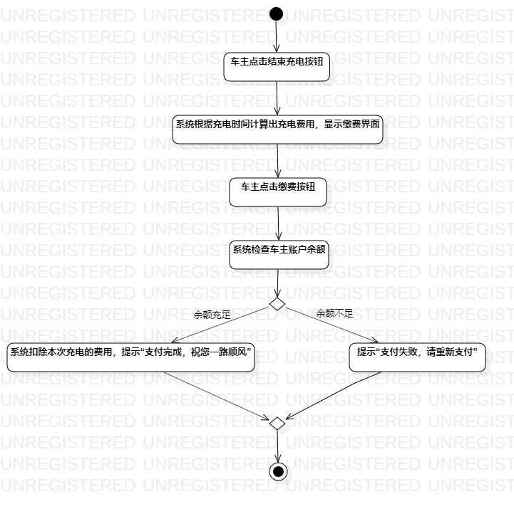
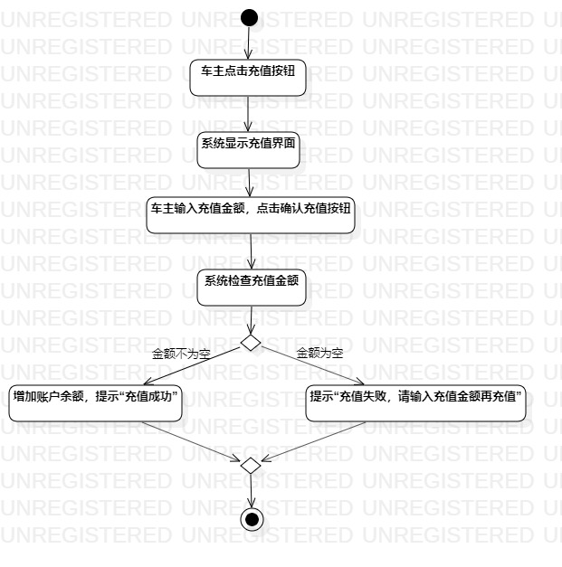

# 实验三：过程建模

## 一、实验目标
1. 掌握过程建模的方法
2. 掌握活动图（Activity Diagram）的画法

## 二、实验内容
根据实验二的用例规约画出相应的活动图

## 三、实验步骤
1. 在B站观看教学视频
2. 在StarUML创建“充电”活动图
- 添加Initial
- 添加Atcion，填写相应操作
- 添加Decision，填写跳转条件
- 添加Final
3. 在StarUML创建“缴费”活动图
- 添加Initial
- 添加Atcion，填写相应操作
- 添加Decision，填写跳转条件
- 添加Final
4. 在StarUML创建“充值”活动图
- 添加Initial
- 添加Atcion，填写相应操作
- 添加Decision，填写跳转条件
- 添加Final
5. 导出活动图并编写实验报告

## 四、实验结果

图1. 充电活动图

图2. 缴费活动图

图3. 充值活动图