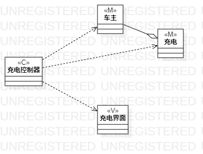
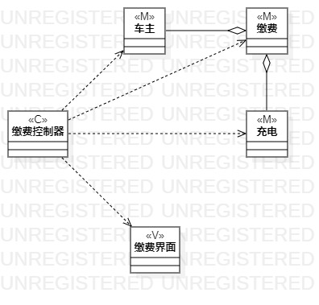
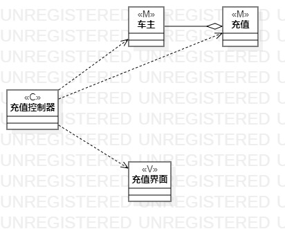

# 实验四五

## 一、实验目标

1. 掌握类建模方法；
2. 了解MVC或你熟悉的设计模式；
3. 掌握类图的画法。（Class Diagram）
4. 理解类的5种关系；
5. 掌握类之间关系的画法。

## 二、实验内容

1. 基于MVC模式设计类；
2. 设计类的关系；
3. 画出类图

## 三、实验步骤

1. 在B站观看视频，了解MVC设计模式
2. 在StarUML绘制类图
    * 模型层(Model)：将用例中的复杂数据类型设计成模型类  
    * 视图层(View)：根据用例中需要使用的界面设计成界面类  
	* 控制器层(Controller)：根据用例中的步骤确定数据和界面之间交互设计控制器类 
    * 确定类之间关系 
3. 导出类图并编写实验报告

## 四、实验结果

图1.充电

图2.缴费

图3.充值
