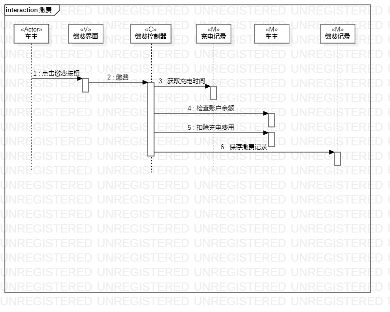
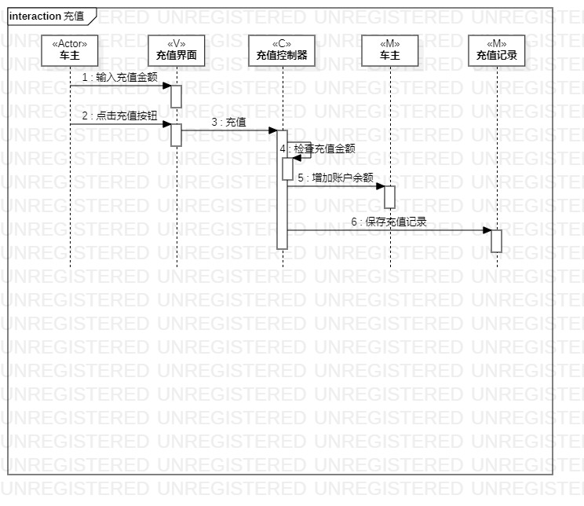

# 实验六

## 一、实验目标

1. 理解系统交互；
2. 掌握UML顺序图的画法；
3. 掌握对象交互的定义与建模方法。

## 二、实验内容

1. 根据用例模型和类模型，确定功能所涉及的系统对象；
2. 在顺序图上画出参与者（对象）；
3. 在顺序图上画出消息（交互）。

## 三、实验步骤

1. 在B站学习顺序图的概念和画法
2. 参考之前的实验中的用例规约、用例图以及类图，对不合理处进行修改
3. 画“充电”顺序图
4. 画“缴费”顺序图
4. 画“充值”顺序图

## 四、实验结果

图1.充电的顺序图

图2.缴费的顺序图

图3.充值的顺序图