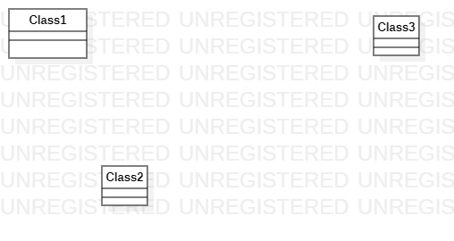

# 实验一

## 一.实验目标

1.熟悉GitHub实验过程  
2.安装与使用StarUML

## 二.实验内容

1.安装GitHub并练习使用Git Bash  
2.安装StarUML并创建一个图

## 三.实验步骤

1.注册GitHub账号  
2.下载StarUML  
3.将实验库克隆到本地的电脑，在这个过程中由于网络的问题卡了非常久，最后在同学的帮助下完成了  
4.按照视频里的指示创建自己的实验文档  
5.将完成的实验提交到GitHub上

## 四.实验结果

1.画图

  
图1.在StarUML上创建的第一个图
