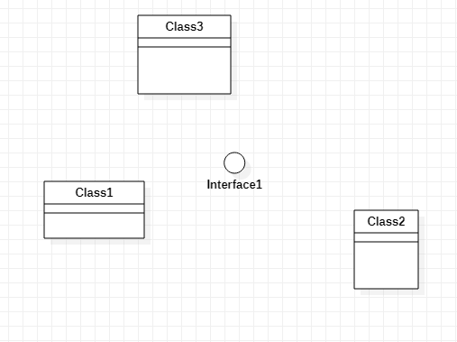

# 实验一

## 实验目标

 1. 熟悉GitHub实验过程
 2. 安装与使用StarUML

## 实验内容

 1. 下载安装git工具和StarUML软件
 2. 运行StarUML软件，并创建一个简单的类图
 3. 完成实验报告
 4. 上传实验内容到GitHub
 
## 实验步骤
 1. 将项目fork到自己的GitHub账号仓库里
 2. 将项目clone到自己的本地
 3. 创建自己的学号包，并创建lab1.md文件
 4. 将lab1.md文件通过git工具提交到GitHub自己的账户上
 5. 运行StarUML文件绘制第一个UML图model1.jpg
 6. 将model1.jpg文件通过git工具提交到GitHub自己的账户上
 7. 在GitHub自己的账户里编辑lab1.md文件，制成实验文档，并在报告中插入UML图
 8. 将自己账户所作的修改pull request到主项目库中
## 实验结果

