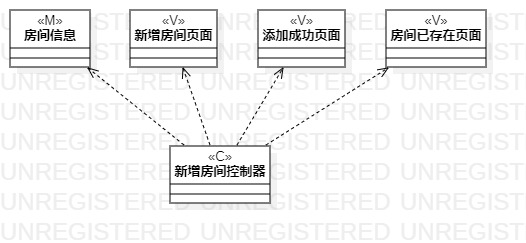
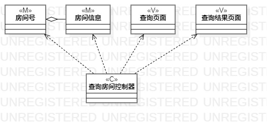
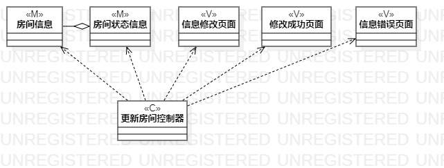

# 实验四、五：类建模与高级类建模

## 一、实验目标

1. 掌握类建模方法；

2. 了解MVC设计模式；

3. 掌握类的五种关系；

4. 掌握类图的画法。

## 二、实验内容

1. 基于MVC模式设计类；

2. 设计类的关系；

3. 画出类图。

## 三、实验步骤
1. 根据用例规约中的基本流程和扩展流程中寻找类；

2. 在StarUML中创建类图：
新增房间信息；
查询房间信息；
修改房间信息；

3. 根据MVC设计模式确定类的关系；

4. 完成类图提交实验报告。

## 四、实验结果

图1：新增房间类图

图2：查询房间类图
 

图3：更新房间类图
  

