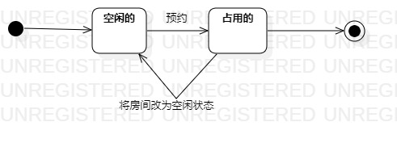

# 实验七：状态建模

## 一、实验目标

1. 掌握状态图及其画法（状态图，Statechart）

## 二、实验内容

1. 学习并理解状态图的定义；
2. 寻找1个重要的对象；
3. 寻找这个对象的所有关键状态；
4. 画出状态之间的转换条件。

## 三、实验步骤

1. 寻找关键对象-房间；

2. 设计房间的状态：占用的，空闲的；

3. 绘制实验预定状态图。

## 四、实验结果

**图1：[房间状态图]**