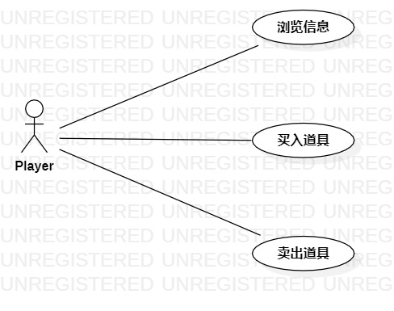

# 实验二：用例建模

## 一、实验目标
1. 学会画用例图
2. 学会编写用例规约

## 二、实验内容
1. 确定选题
2. 根据选题在StarUML中创建用例图
3. 根据用例图编写用例规约

## 三、实验步骤
1. 在GitHub上创建Issue并填写相应功能
2. 在StartUML中创建Use case Diagram
3. 根据选题确定参与者为“HR”
4. 确定用例为：
   - 发布招聘信息
   - 修改招聘信息
   - 删除招聘信息
5. 创建对应关系
6. 导出用例图
7. 根据用例图编写用例规约，完成实验报告

## 四、实验结果

 

 图1 招聘管理系统用例图

 ## 表1：发布招聘信息用例规约  

用例编号  | UC01 | 备注  
-|:-|-  
用例名称  | 发布招聘信息  |   
前置条件  | HR登录进入招聘管理系统     |    
后置条件  |     |    
基本流程  | 1. HR点击发布按钮  |    
~| 2. 系统显示发布招聘信息页面  |   
~| 3. HR输入职位描述、应聘条件、工资待遇，设置职位数量，点击确定按钮  |   
~| 4. 系统检查招聘信息合法，职位数量大于0，保存招聘信息  |   
~| 5. 系统显示“发布成功”  |  
扩展流程  | 4.1 系统检查招聘信息非法，提示“招聘信息非法” |    
~| 4.2 系统检查职位数量为0，提示“职位数量不能为零”  |  

 ## 表2：修改招聘信息用例规约  

用例编号  | UC02 | 备注  
-|:-|-  
用例名称  | 修改招聘信息  |   
前置条件  | HR登录进入招聘管理系统     |    
后置条件  |      |   
基本流程  | 1. HR选择招聘信息，点击修改按钮  |    
~| 2. 系统检查当前职位未被投递简历，显示修改招聘信息页面  |   
~| 3. HR修改招聘信息，点击确定按钮  |   
~| 4. 系统检查修改信息合法，职位数量大于0，更新招聘信息  |   
~| 5. 系统显示“修改成功”  |  
扩展流程  | 2.1 系统检查职位已被投递简历，提示“当前职位已被投递简历，不能修改信息”  |
~|4.1 系统检查修改信息非法，提示“修改信息非法” |
~|4.2 系统检查职位数量为0，提示“职位数量不能为零” |    

 ## 表3：删除招聘信息用例规约  

用例编号  | UC03 | 备注  
-|:-|-  
用例名称  | 删除招聘信息  |   
前置条件  | HR登录进入招聘管理系统     |    
后置条件  |      |    
基本流程  | 1. HR选择招聘信息，点击删除按钮  |    
~| 2. 系统检查职位未被投递简历，删除招聘信息  |   
~| 3. 系统提示“删除成功”  |   
扩展流程  | 2.1 系统检查职位已被投递简历，提示“当前职位已被投递简历，不能删除信息”  |    