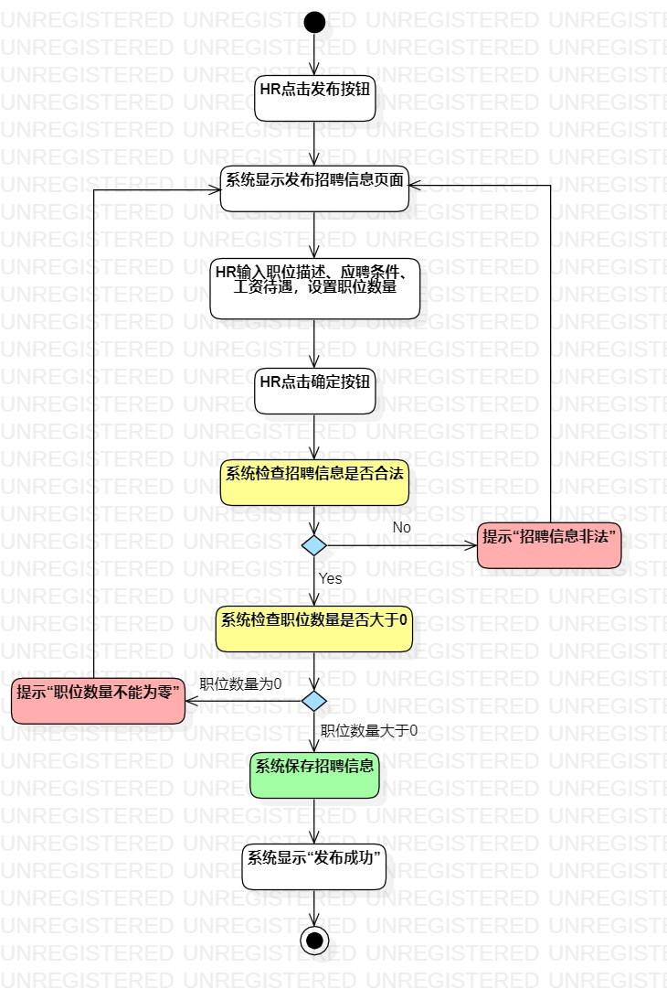
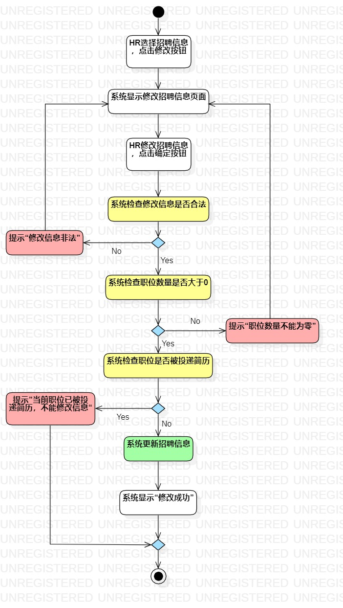
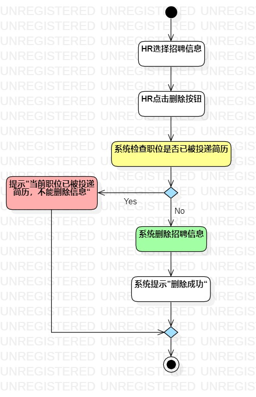

# 实验三：过程建模

## 一、实验目标

1. 掌握过程建模的方法
   
2. 掌握活动图的画法

## 二、实验内容

1. 根据用例规约画活动图
   
## 三、实验步骤

1. 先上学习通看实验要求，然后观看视频了解实验的具体做法
   
2. 根据实验二的用例规约，在StarUML中创建“发布招聘信息”，“修改招聘信息”和“删除招聘信息”三个活动图
   
3. 使用开始节点、结束节点、活动、决策、控制流等符号画出活动图
   
4. 通过对齐、自动调整大小、改变线段类型、上色等操作调整活动图的排版
   
## 四、实验结果

1. 发布招聘信息活动图

2. 修改招聘信息活动图

3. 删除招聘信息活动图
