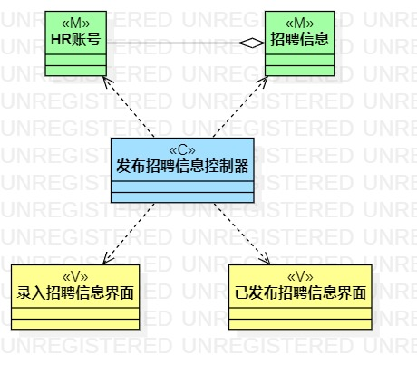
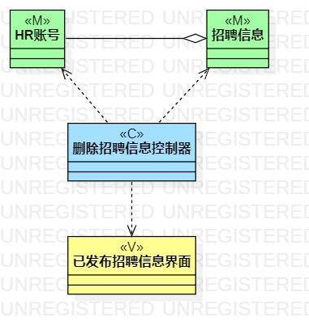

# 实验四：类建模 & 实验五：高级类建模

## 一、实验目标

1. 掌握类建模方法；
2. 了解MVC或你熟悉的设计模式；
3. 掌握类图的画法；
4. 理解类的5种关系；
5. 掌握类之间关系的画法。

## 二、实验内容

1. 基于MVC模式设计类；
2. 设计类的关系；
3. 画出类图。

## 三、实验步骤

1. 先上网了解MVC模式
2. 根据MVC模式和用例规约，确定各层包含哪些类
   * Model层：发布、修改、删除的对象都是招聘信息，所以需要一个招聘信息类，同时对招聘信息的这些操作都需要HR来完成，所以还要一个HR账号类，同时招聘信息里面除了职位的信息，还应该包含HR的信息，所以招聘信息和HR账号之间是聚合的关系
   * View层：发布和修改都需要进入单独的页面操作，同时操作完成后要回到显示所有已发布招聘信息的界面，删除只需要在该界面上操作就行
   * Controller层：三种功能对应三个不同的控制器，用于控制Model层和View层之间的交互
3. 在StarUML中制作三个类图

## 四、实验结果

图1：发布招聘信息类图

图2：修改招聘信息类图

图3：删除招聘信息类图

## 五、实验总结

1. MVC模式：
    * Model层：表示数据和业务规则
    * View层：与用户交互的界面
    * Controller层：负责Model和View层之间的通信
2. 类中共有5中关系：依赖、关联、聚合、组合、继承，在设计的过程中应该尽量降低类与类之间的关系，使程序具有良好的可重用性和可维护性
3. 在确定Model层的时候，先确定操作的主体，然后再思考操作该主体时还需要用到哪些类