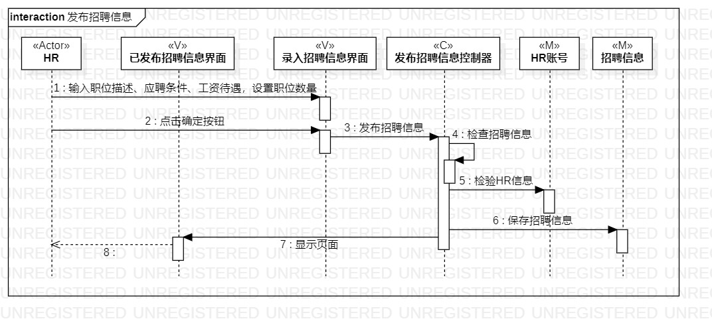
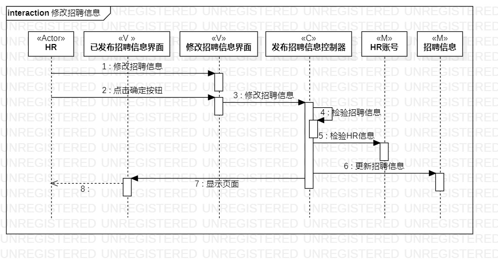
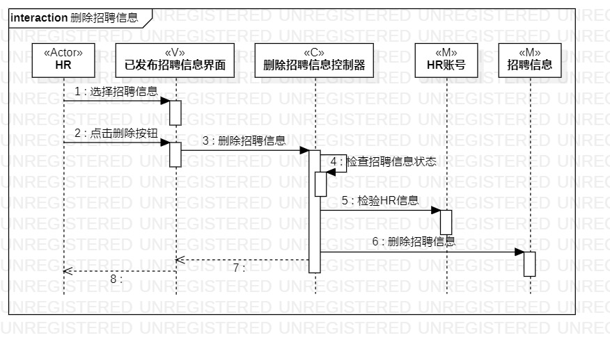

# 实验六：交互建模

## 一、实验目标

1. 理解系统交互
2. 掌握UML顺序图的画法
3. 掌握对象交互的定义与建模方法

## 二、实验内容

1. 根据用例模型和类模型，确定功能所涉及的系统对象
2. 在顺序图上画出参与者（对象）
3. 在顺序图上画出消息（交互）

## 三、实验步骤

1. 先观看视频，了解循序图的概念，学习顺序图各种符号的意义及用法
    * 共有1 + N个参与者：类图的N个加上1个实际的参与者
    * 参与者之间的交互通过传递Message完成
    * 最核心的一步应与用例名相同
2. 确定1 + N个参与者
    * HR为所有活动的主要参与者
    * 发布招聘信息:发布招聘信息界面,已发布招聘信息界面,发布招聘信息控制器,HR账号,招聘信息
    * 修改招聘信息:修改招聘信息界面,已发布招聘信息界面,修改招聘信息控制器,HR账号,招聘信息
    * 删除招聘信息:已发布招聘信息界面,删除招聘信息控制器,HR账号,招聘信息
3. 在UML中创建顺序图,添加上述参与者的存活条/激活条,按照时间循序画出每个步骤传递的消息

## 四、实验结果

图一 发布招聘信息顺序图

图二 修改招聘信息顺序图

图三 删除招聘信息顺序图

## 五、实验总结

1. N个参与者由类图确定，剩下的一个参与者就是实际参与的用户
2. 在画的时候一定要严格的按照向后循序画
3. 传递消息类似于函数调用，消息的输出方调用输入方的函数，所以消息的输入方必须有该函数
4. 由于使用的是MVC模式，V和M之间消息的传递应该都是通过C来完成的，不应该出现V和M之间直接传递消息的现象