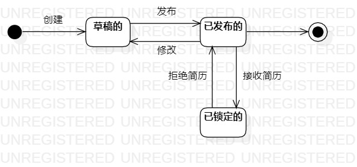

# 实验七：状态建模

## 一、实验目标

1. 掌握对象状态建模（状态图，Statechart）

## 二、实验内容

1. 寻找一个关键的对象
2. 设计该对象的关键状态
3. 设计状态之间的转变条件

## 三、实验步骤

1. 确定要描述的对象
    * 招聘信息：作为一个管理招聘信息的系统，基本上所有的操作都是基于招聘信息的，所以招聘信息是最关键的对象
2. 确定招聘信息的各个状态
    * 在发布之前处于草稿的状态
    * 发布后处于已发布的状态
    * 被求职者投递简历后处于不可修改的状态
3. 确定使招聘信息转换状态的操作
    * 创建：HR点击创建后从初始节点进入 “草稿的” 状态
    * 发布：HR编辑完并点击发布按钮后从 “草稿的” 变为 “已发布的” 状态
    * 修改：HR点击修改后从 “已发布的” 回到 “草稿的” 状态
    * 接收简历：接收到求职者投递的简历后 “已发布的” 招聘信息不能被修改，进入 “不可修改的” 状态
    * 拒绝简历：拒绝掉求职者的简历后招聘信息又从 “不可修改的” 回到 “已发布的” 状态

## 四、实验结果

招聘信息状态图

## 五、实验总结

1. 选择建模对象时应该尽量选最关键的对象
2. 状态存在的前提是对象存在，不存在的对象没有状态，如还没创建或被销毁的对象；每个状态都应该不同，每个状态之间肯定能找出不同的地方
3. 导致状态转换的肯定是某个或某种操作