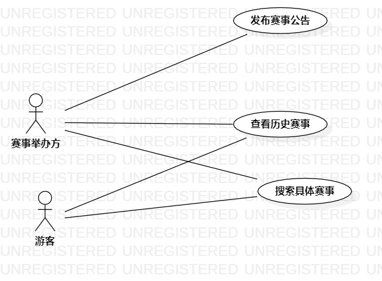

# 实验二
## 1.实验目标  
- 掌握用例图的方法  
- 画出自己课题对应例图
## 2.实验内容
- 细化功能需求。    
- 画出用例图（Use Case Diagram）。  
- 编写用例规约（表格）。
## 3.实验步骤  
- 看教学视频  
- 对着教学视屏敲一次  
- 开始做自己的实验Issues课题  

## 4.实验结果  
  
       图一（PUBG赛事信息网的用例图）  
       # 用例规约的编写

## 表1：发布赛事用例1规约  

用例编号  | UC01 | 备注  
-|:-|-  
用例名称  | 发布赛事 |   
前置条件  | 用户已登录  | *可选*   
后置条件  |    赛事发布  | *可选*   
基本流程  |1. 用户点击发布赛事连接|
~| 2.系统显示编辑赛事信息页面|   
~| 3.  用户填写赛事信息，点击发布 |   
~| 4.  系统显示首页赛事发布信息页面 |  
扩展流程  

## 表2：查看历史赛事用例2规约  

用例编号  | UC02 | 备注  
-|:-|-  
用例名称  | 查看历史赛事 |   
前置条件  |      |
后置条件  |      |  
基本流程  | 1.游客点击历史赛事链接  | 
~| 2.系统显示历史赛事页面 | 
扩展流程   

## 表3：查看具体赛事用例3规约  

用例编号  | UC03 | 备注  
-|:-|-  
用例名称  |查看具体赛事 |   
前置条件  |      | 
后置条件  |      |   
基本流程  | 1.游客点击查询链接  |
~| 2.系统显示查询信息页面|   
~| 3.游客输入查询赛事名称，点击查询   |   
~| 4.  系统查询赛事信息，名称匹配，显示赛事信息 |   
扩展流程  | 4系统显示赛事不存在页面|   
