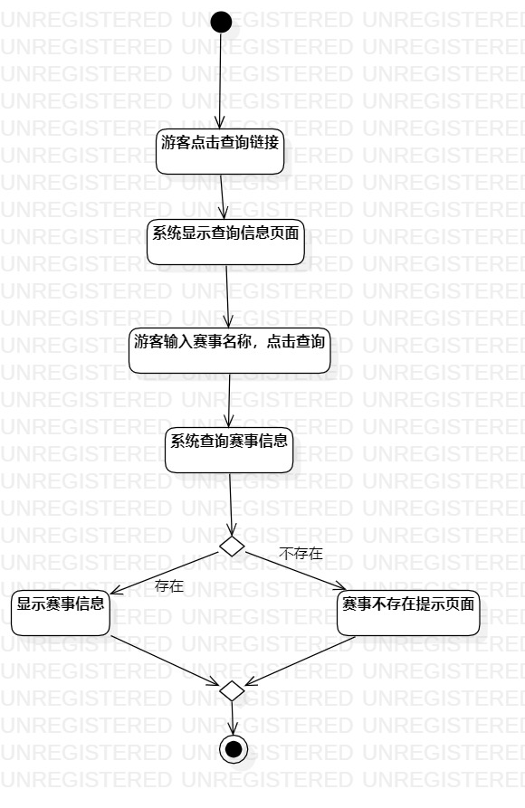
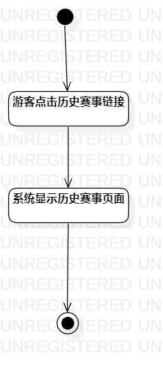
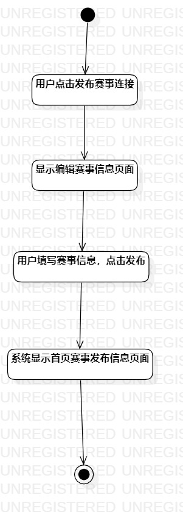

# 实验三
## 1.实验目标  
- 掌握过程建模方法；  
- 掌握活动图的画法。（Activity Diagram）

## 2.实验内容
- 根据自己的规约画出相关活动图
- 在编写实验报告并在报告中显示所画的活动图
- 把同一个活动图也显示/插入到Pull Request的首页上
## 3.实验步骤  
- 观看教学视频
- 修改实验2规约
- 查看实验要求
- 对照自己的规约着手画活动图

## 4.实验结果  
   
       图一 
       
     
  图二
  
  
  图三
  

