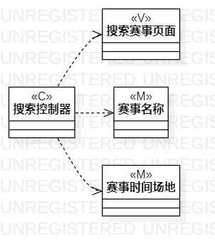

# 实验4、5
## 1.实验目标    
- 掌握l类建模方法；    
- 了解MVC或你熟悉的设计模式  
- 掌握类图的画法。（Class Diagram）

## 2.实验内容
- 基于MVC模式设计类；  
- 设计类的关系；  
- 画出类图。  
## 3.实验步骤  
- 观看教学视频
- 根据自己的规约找到相应的类
- 查看实验要求
- 对照自己的规约着手画类图

## 4.实验结果  
   
       图一   
       
  图二  

