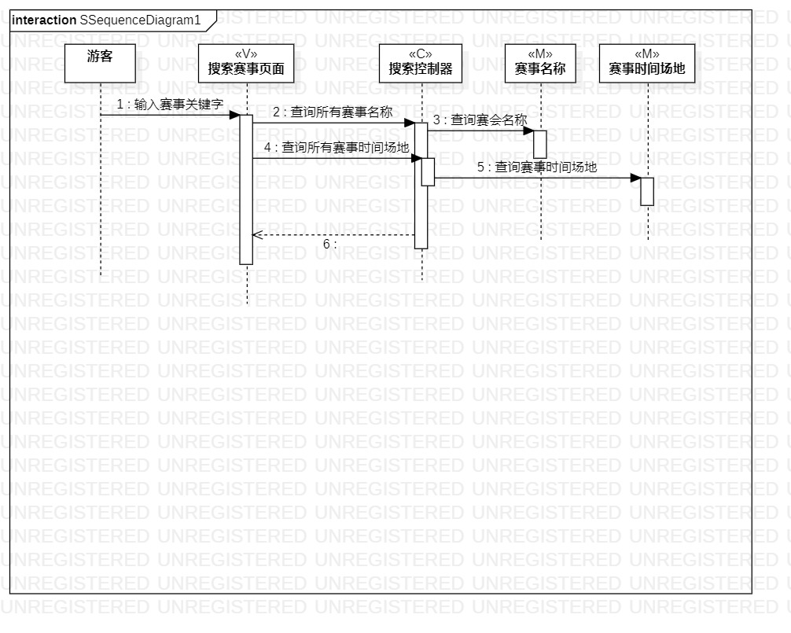

# 实验三
## 1.实验目标  
- 理解系统交互；  
- 掌握UML顺序图的画法；
- 掌握对象交互的定义与建模方法。

## 2.实验内容
- 根据用例模型和类模型，确定功能所涉及的系统对象；  
- 在顺序图上画出参与者（对象）；  
- 在顺序图上画出消息（交互）。  
## 3.实验步骤  
- 观看教学视频
- 查看实验要求
- 对照自己的课题找到对应系统对象  
- 着手画图

## 4.实验结果  
     
       图一   
       
  图二  

