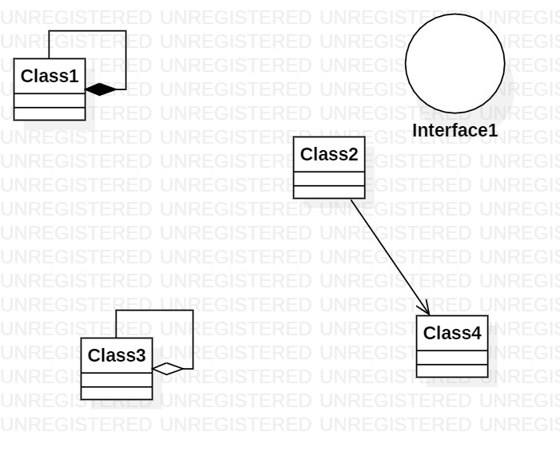

# UML实验1报告文档 

## 实验内容
学习尝试使用Git工具和UML软件  

## 实验步骤  
1.下载课程相关工具，Git Shell与UML；  
2.在Github上Fork项目并Clone到本地；  
3.创建实验文档，使用Git工具上传并Pull Request；  
4.创建尝试使用UML软件，建立UML图，用同样的方式上传并Pull Request；  
5.在Github上面编辑文档，并插入图片。  

## 实验结果  

