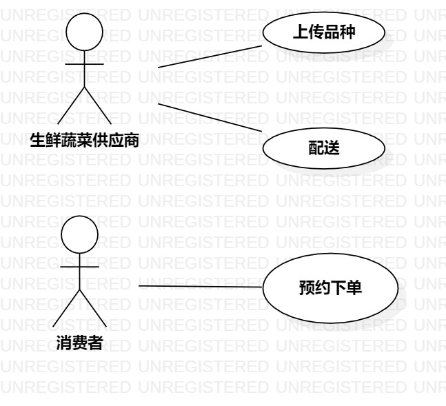

# UML实验2报告文档 

## 实验目标
- 学会选题Issue提交的题目表述规范；
- 熟悉使用UML工具建立用例图；
- 掌握用例规约表的使用

## 实验内容
- 在Issue中提交选题题目；
- 根据选题内容使用UML建模用例图；
- 编写用例规约表格

## 实验步骤  
- 在Issue上提交选题 #434；  
- 创建用例图，根据选题要求添加使用者与操作用例；  
- 结合选题与用例图编写用例规约  
  

## 实验结果  

  
生鲜蔬菜配送系统用例图  
  

## 表1：上传品种用例规约  

用例编号  | UC01 | 备注  
-|:-|-  
用例名称  | 上传品种  |   
前置条件  |   供应商已登录供应商账号   | *可选*   
后置条件  |     | *可选*   
基本流程  | 1. 供应商点击“上传品种”按钮；  |*用例执行成功的步骤*    
~| 2. 系统显示输入商品信息界面；  |   
~| 3. 供应商输入商品信息，点击“上传”按钮；  |   
~| 4. 系统确定信息按规定填写，保存该供应商上传的商品,生成商品编号。  |    
扩展流程  | 4.1 系统检查发现未按规定填写信息，提示“请重新填写信息后上传”；  |*用例执行失败*    
~| 4.2 系统检查商品名称发现该供应商上传重复商品，提示“请勿重复上传”。  |  

## 表2：配送用例规约  

用例编号  | UC02 | 备注  
-|:-|-  
用例名称  | 配送  |   
前置条件  |   供应商已登录供应商账号   | *可选*   
后置条件  |     | *可选*   
基本流程  | 1. 供应商点击“选择配送”按钮；  |*用例执行成功的步骤*    
~| 2. 系统显示预约下单订单；  |   
~|3. 供应商选择配送订单；  |   
~|4. 系统显示所选订单的商品；  | 
~|5. 供应商备货后点击“开始配送”；  | 
~| 6. 系统检查当前时间符合配送订单时段，更新所选订单状态，订单锁定到供应商账号。  |    
扩展流程  | 6.1 系统检查发现时间与该订单消费者规定所配送时段不符合，提示“请在规定配送时段内为该客户进行配送”，返回选择订单界面。  |*用例执行失败*         

## 表3：预约下单用例规约  

用例编号  | UC03 | 备注  
-|:-|-  
用例名称  | 预约下单  |   
前置条件  |   消费者已登录消费者账号   | *可选*   
后置条件  |      | *可选*   
基本流程  | 1. 消费者点击“我要预订”按钮；  |*用例执行成功的步骤*    
~| 2. 系统显示供应商列表；  |   
~| 3. 消费者选择供应商；  |   
~| 4. 系统显示所选择供应商的商品；  |    
~| 5. 消费者选择要下单的商品及数量后，点击“下一步”按钮；  |    
~| 6. 系统显示该供应商可配送时段；  |    
~| 7. 消费者选择要配送的时段后，点击“确认下单”按钮；  |
~| 8. 系统保存消费者下单内容，生成订单。  |    
扩展流程  | 5.1 系统检查发现消费者所选择的商品库存不足，提示“所选商品库存不足，请重新选择”，返回商品选择界面；  |*用例执行失败*    
~| 7.1 点击选择配送时段时，系统检查发现该时段若订单量过多，提示“该时段配送量大，请重新选择”，返回选择配送时段界面。  |  

