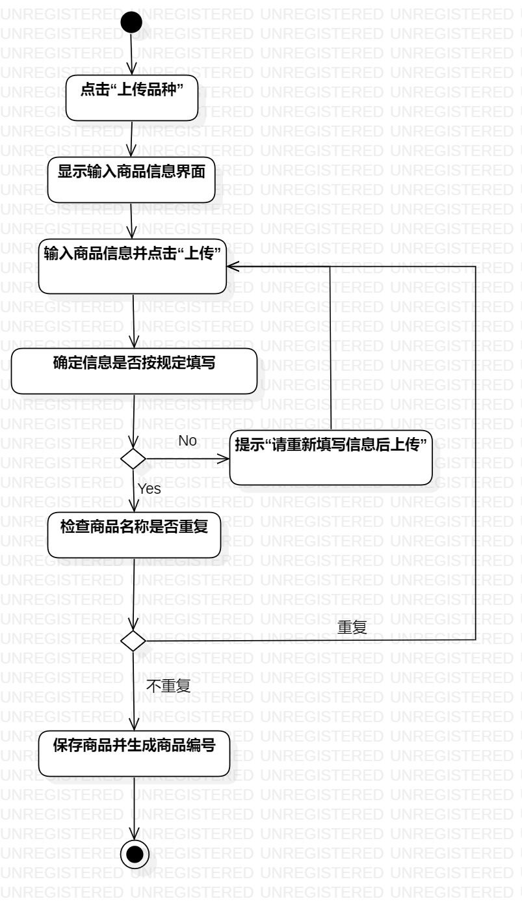
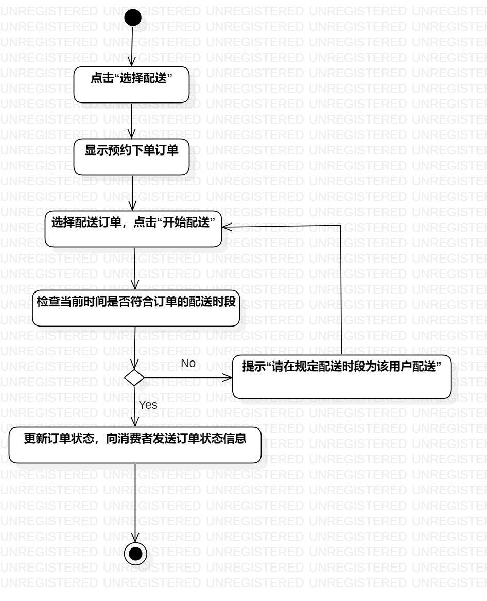
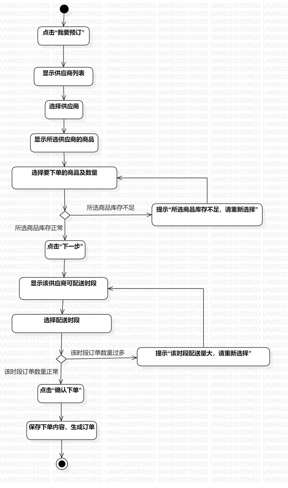

# UML实验3报告文档 

## 实验目标
- 掌握过程建模的概念及方法；
- 学会使用UML软件结合用例画活动图。

## 实验内容
- 在StarUML中根据用例创建活动图；
- 分析用例的操作。

## 实验步骤  
- 在StarUML中创建一个新的活动图，并新增一个开始节点；  
- 根据用例中的流程创建操作；  
- 在分支操作处使用决策节点分离；
- 根据用例连接不同的操作；
- 将分离的操作进行汇合后，最后一步连接到结束节点；
- 根据用例构建另外两个用例的活动图。
  

## 实验结果  

  
生鲜蔬菜配送系统上传品种用例活动图  
  
  
生鲜蔬菜配送系统配送用例活动图  

  
生鲜蔬菜配送系统预约下单用例活动图  
