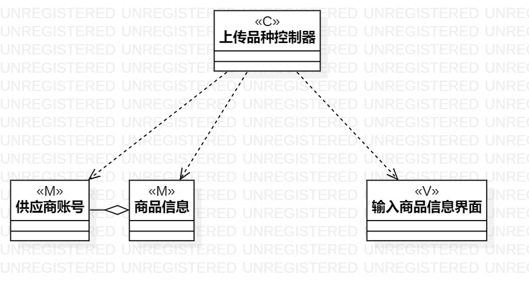
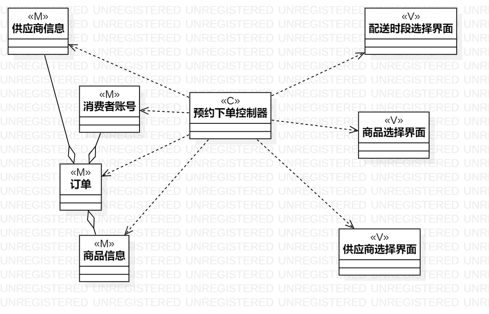

# UML实验4、5报告文档 

## 课堂笔记
- 迄今所学三类图的区别
1. 用例图：What to do?
2. 活动图：How to do?
3. 类图：Who do?
- 类的描述有属性与操作两个，其中属性值发生变化的状态，操作时定义对象的行为；
- 类图的画法：矩形=名称+属性+操作；
- 类图的可见性有四种，分别是：Public(+)、Protected(#)、Package(~)、Private(-)；
- 结合课件，共有五种类的关系，使用Weaker Class Relationship有低耦合的优点，推荐使用；
- 常见熟悉的设计模式为MVC，M为Model（模型、实体、数据），V为View（视图、界面、AbcUI），C为Control（控制器、系统、Service），结合之前学习Javaweb与数据库课程不难理解。

## 实验目标
- 掌握类建模的概念及设计方法；
- 学会使用UML软件结合用例画出用例相关的类图；
- 学习了解MVC的设计模式。

## 实验内容
- 掌握MVC设计模式；
- 结合用例的内容画出相关的类图。

## 实验步骤  
- 查看实验要求并观看实验视频；  
- 复习掌握MVC设计模式；  
- 分析所设计的用例，在UML中创建类图；
- 创建相应类图，并根据用例连接；
- 根据用例构建另外两个用例的类图。
  

## 实验结果  

  
生鲜蔬菜配送系统上传品种类图  
  
  
生鲜蔬菜配送系统配送类图  

  
生鲜蔬菜配送系统预约下单类图  
