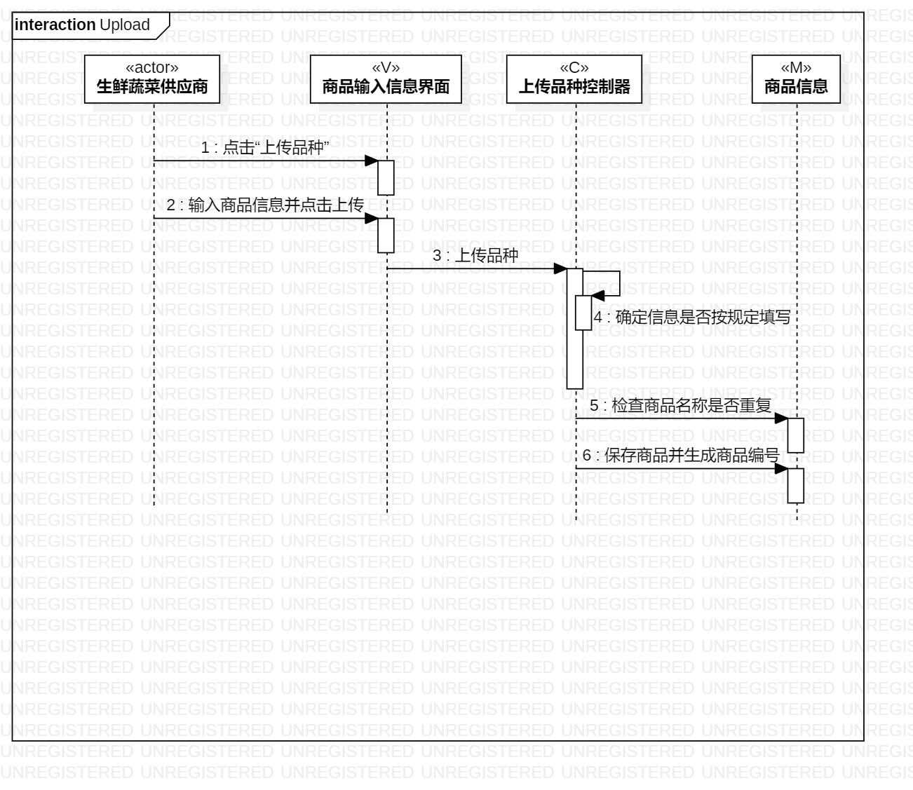
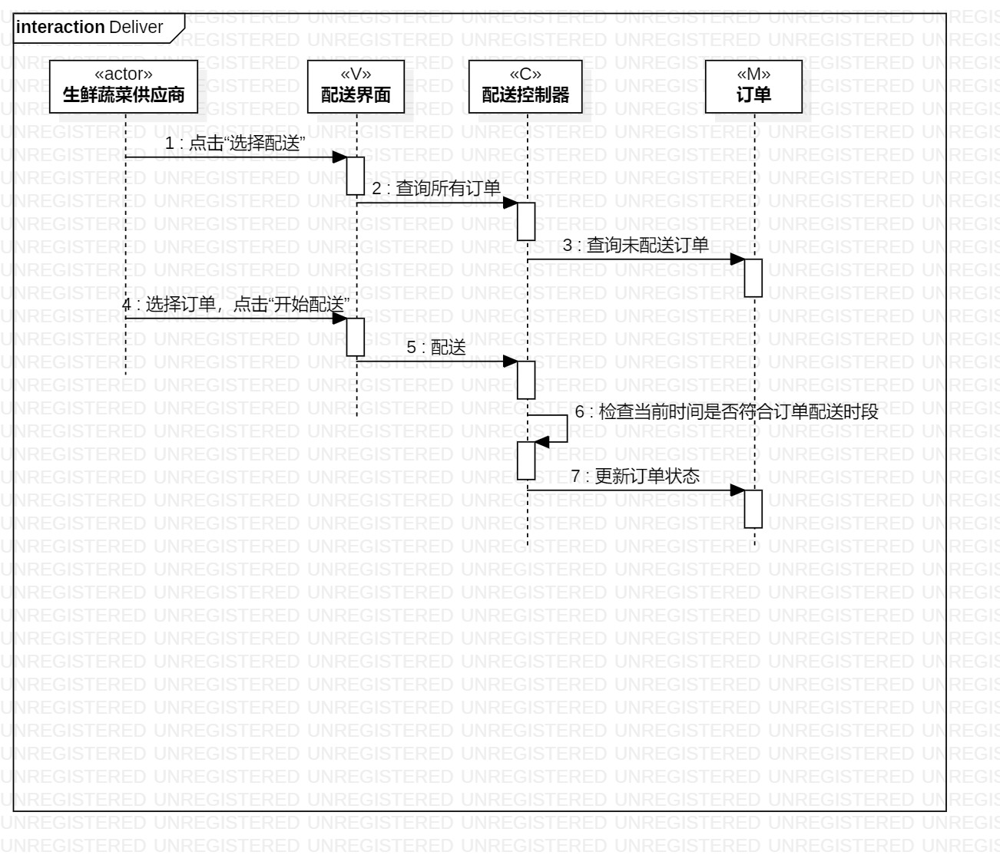
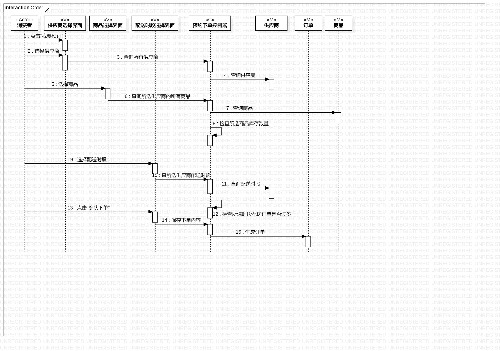

# UML实验6报告文档 

## 实验目标
- 掌握顺序图建模的概念及设计方法；
- 学会使用UML软件结合前几次实验的图画出相应的顺序图；
- 深入熟悉所选用例的过程。

## 实验步骤  
- 查看实验要求并观看实验六的相关视频；    
- 分析所设计的用例，在UML中创建顺序图；
- 结合活动图、用例图与类图，分别创建三个顺序图；
- 将顺序图的逻辑进行梳理，对前面所做的实验进行修改。
  

## 实验结果  

  
生鲜蔬菜配送系统上传品种顺序图  
  
  
生鲜蔬菜配送系统配送顺序图  

  
生鲜蔬菜配送系统预约下单顺序图  
