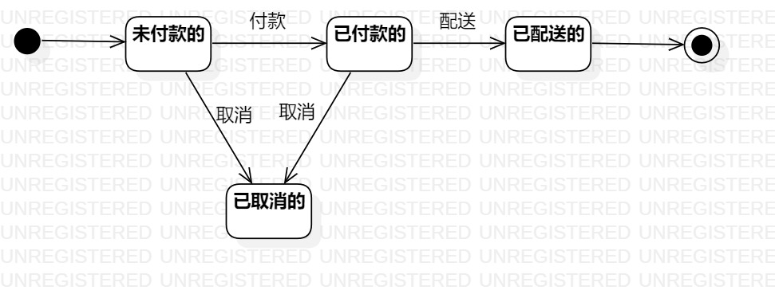

# UML实验7报告文档 

## 实验目标
- 掌握对象状态建模的方法；
- 结合前几次实验寻找出一个重要对象。

## 实验内容
- 完善前六次实验图；
- 结合前六个实验找出一个重要对象；
- 结合对象画出状态图。

## 实验步骤  
- 查看实验要求并观看实验七的相关视频；    
- 对前几次实验图进行细化修改；
- 结合活动图、用例图、类图与顺序图，确定订单这一对象；
- 根据所选对象结合设计的功能及需求进行状态图的设计。
  

## 实验结果  

  
