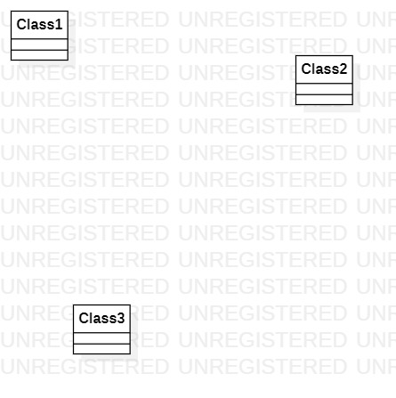

# 实验一

## 一、实验目标

1. 熟悉GitHub的使用
2. 安装并使用StarUML

## 二、实验内容

1. 安装GitHub并练习使用git bash
2. 安装StarUML并创建第一个图

## 三、实验步骤

1. 将自己GitHub账号下相对应课程克隆到本地，形成副本3。
2. 学习掌握GitHub相关操作，并解决使用GitHub过程中出现的相关操作问题。
3. 完成主库Issues下的功能选题"网购订单系统"。

## 四、实验结果

图1. 在StarUML画的第一个图
