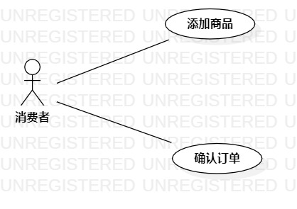

# 实验二：用例建模 

## 一、实验目标

1. 细化选题
2. 学习使用StarUML用例建模
3. 使用Markdown编写报告

## 二、实验内容

1. 创建用例图
2. 编写实验报告文档
3. 编写用例规约

## 三、实验步骤

1. 选题为"网购订单系统"
2. 根据issue在StarUML上创建用例图
3. 确定参与者为"消费者""商家"
4. 确定用例为"下订单" "确认订单"
5. 建立参与者与用例的关系
6. 画出用例图
7. 编写用例规约

## 四、实验结果

1. 画图

图1:网购订单系统的用例图

## 表1：下订单用例规约 

用例编号  | UC01 | 备注  
-|:-|-  
用例名称  | 下订单  |   
前置条件  | 消费者进入网上商家店铺  | *可选*   
后置条件  | 消费者跳转到支付界面  | *可选*   
基本流程  | 1. 消费者选择商品  |*用例执行成功的步骤*    
~| 2. 系统显示商品简介页面  |   
~| 3. 消费者选择数量，点击确定  |   
~| 4. 系统查询商品库存信息表，检查该商品数量条件满足，系统根据商品的种类及数量生成订单  |   
~| 5. 系统显示"下单成功"  |  
扩展流程  | 4.1 系统查询商品库存信息表，检查该商品数量不足，提示消费者"该商品库存数量不足" |*用例执行失败*    

## 表2：确认订单用例规约  

用例编号  | UC02 | 备注  
-|:-|-  
用例名称  | 确认订单  |   
前置条件  | 商家进入待确定订单界面  | *可选*   
后置条件  |   | *可选*   
基本流程  | 1. 商家选择待确认订单  |*用例执行成功的步骤*    
~| 2. 系统跳转到该待确认订单界面  |   
~| 3. 商家确认消费者的基本地址信息和联系方式，点击确定  |   
~| 4. 系统查询库存数量表，确认该商品库存足够并减去相应的数量，系统修改订单的状态为已确认 |   
~| 5. 系统显示"订单已确认"  |  
扩展流程  | 4.1 系统查询商品库存数量表，发现该商品库存数量不足以减去订单数量，显示"该商品库存数量不足"  |*用例执行失败*    
