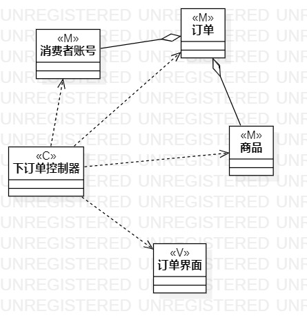
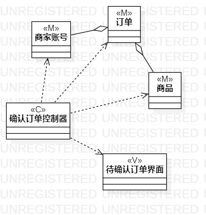

# 实验四、五：类建模
## 一、实验目标

1. 掌握类建模方法
2. 了解MVC设计模式
3. 掌握类图的画法
4. 理解类的关系

## 二、实验内容

1. 学习类图概念
2. 了解类与类之间的基本关系
3. 根据用例规约进行类建模

## 三、实验步骤

1. 观看老师所发视频，了解MVC模式
2. 百度查询资料，加深对六种基本关系的理解:  
 - 泛化 （Generalization）   
  【泛化关系】：是一种继承关系，表示一般与特殊的关系，它指定了子类如何特化父类的所有特征和行为。    
  【箭头指向】：带三角箭头的实线，箭头指向父类。   
 - 实现 （Realization）    
  【箭头指向】带三角箭头的虚线，箭头指向接口。  
 - 关联 （Association)  
  【关联关系】：是一种拥有的关系，它使一个类知道另一个类的属性和方法。  
  【箭头及指向】：带普通箭头的实心线，指向被拥有者。  
 - 聚合（Aggregation）  
  【聚合关系】：是整体与部分的关系，且部分可以离开整体而单独存在。  
  【箭头及指向】：带空心菱形的实心线，菱形指向整体。  
 - 组合(Composition)  
  【组合关系】：是整体与部分的关系，但部分不能离开整体而单独存在。  
  【箭头及指向】：带实心菱形的实线，菱形指向整体。  
 - 依赖(Dependency)  
  【依赖关系】：是一种使用的关系，即一个类的实现需要另一个类的协助，所以要尽量不使用双向的互相依赖。  
  【箭头及指向】：带箭头的虚线，指向被使用者。  
2. 回顾实验二所作用例规约，思考如何下手进行类建模。  
3. 使用StarUML绘制类建模用例图。  
4. 根据用例规约画出各个类并根据类之间的关系用对应的线连起来。

## 四、实验结果

  
图1：下订单的类图

  
图2：确认订单的类图
