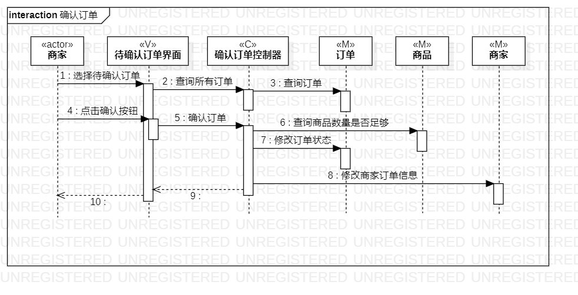

# 实验六：交互建模

## 一、实验目标

1. 理解系统交互的概念；
2. 掌握UML顺序图的画法；
3. 掌握对象交互的定义与建模方法。

## 二、实验内容

1. 据活动图和类图，确定功能所涉及的系统对象；
2. 在顺序图上画出参与者；
3. 在顺序图上画出消息。

## 三、实验步骤

1. 理解顺序图的符号意义及其用法；
2. 在StarUML创建SequenceDiagram；
3. 思考类图的严谨性，对应类图添加Lifeline；
4. 根据活动图确定消息，添加message；
5. 思考顺序图的严谨性，修改类图、顺序图；
6. 使用Git Bash提交图片；
7. 在GitHub上提交实验报告。

## 四、实验结果

  
图1：下订单的交互图

  
图1：确认订单的交互图
