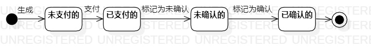

# 实验七：状态建模

## 一、实验目标

1. 掌握状态建模方法。
2. 掌握状态图的画法。（Statechart）

## 二、实验内容

1. 根据用例规约图、活动图、用例图、类图、顺序图创建状态图。
2. 寻找一个最关键的对象。
3. 设计对象的关键状态，并用形容词描述。
4. 为各个状态的转换添加转变条件。

## 三、实验步骤

1. 根据用例规约图、活动图、用例图、类图、顺序图画状态图
2. 添加Initial和Final
3. 添加关键对象，这次实验选取对象为订单。
4. 结合活动图，顺序图添加关键状态。
5. 为各个状态之间的转换添加条件
6. 使用Git Bash提交图片；
7. 在GitHub上提交实验报告。

## 四、实验结果

  
图1：订单的状态图
