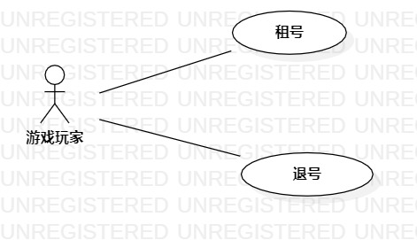

# 实验二：用例建模  

## 一、 实验目标  

1. 使用Markdown编写报告
2. 选题
3. 学习使用StarUML用例建模

## 二、 实验内容  

1. 创建用例图
2. 编写实验报告文档
3. 编写用例规约

## 三、 实验步骤  

1. 选题为游戏账号租赁系统
2. 确定参与者（Actor）:  
      - 游戏玩家   
3. 确定用例（UserCase）:   
      - 租号
      - 退号
4. 建立Actor和UserCase之间的联系并绘画用例图（lab2_UseCaseDiagram1）
5. 编写用例规约

## 四、 实验结果  
  
  
图1:游戏账号租赁系统的用例图

## 表1：租号用例规约  

用例编号  | UC01 | 备注  
-|:-|-  
用例名称  | 租号  |   
前置条件  | 游戏玩家登录进入游戏账号租赁系统     | *可选*   
后置条件  | 游戏玩家进入游戏租号页面    | *可选*   
基本流程  | 1.游戏玩家点击租号链接；  |*用例执行成功的步骤*    
~| 2.系统显示游戏租号页面；  |   
~| 3.游戏玩家根据游戏类型选择喜欢的游戏账号，支付金额；|   
~| 4.系统为游戏玩家提供游戏账号信息；   |   
~| 5.系统显示租号成功。   |  
扩展流程  | 3.1 游戏玩家没有看到喜欢的游戏账号；   |*用例执行失败*    
~| 3.2 游戏玩家没有支付金额。  |  

## 表2：退号用例规约  

用例编号  | UC02 | 备注  
-|:-|-  
用例名称  | 退号  |   
前置条件  | 游戏玩家租号成功     | *可选*   
后置条件  | 系统退回一部分金额到游戏玩家在租赁系统的账号     | *可选*   
基本流程  | 1.游戏玩家点击退号链接；  |*用例执行成功的步骤*    
~| 2.系统显示租号的交易记录；  |   
~| 3.游戏玩家点击需要退号的交易记录；   |   
~| 4.系统退回部分金额到游戏玩家在租赁系统的账号；   |   
~| 5.系统显示退号成功。   |  
扩展流程  | 4.1 游戏玩家租号的时长已结束，系统不会退钱。   |*用例执行失败*    
