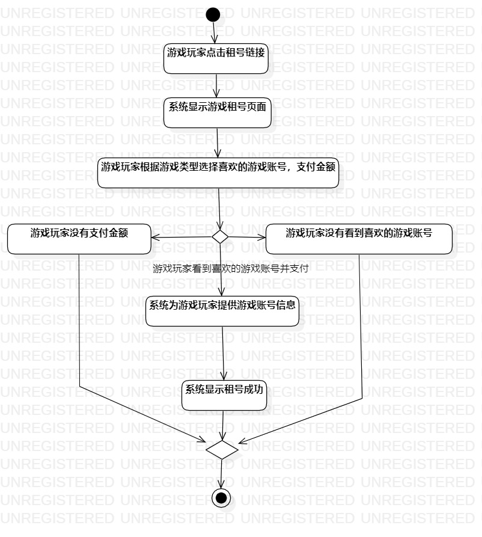
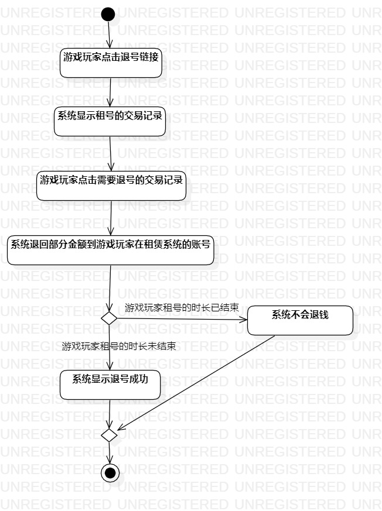

# 实验三：过程建模

## 一、实验目标
1. 掌握过程建模的方法
2. 掌握活动图（Activity Diagram）的画法

## 二、实验内容
根据实验二的用例规约画出相应的活动图

## 三、实验步骤
1.在StarUML创建“租号”活动图
- 添加Initial和Final
- 添加Atcion，填写相应操作
- 添加Decision，填写跳转条件
- 添加一个Merge将分支汇总
- 用control flow连接各个部分
- 调整各部分位置，图要简洁美观
2. 在StarUML创建“退号”活动图
- 添加Initial和Final
- 添加Atcion，填写相应操作
- 添加Decision，填写跳转条件
- 添加一个Merge将分支汇总
- 用control flow连接各个部分
- 调整各部分位置，图要简洁美观
3. 导出活动图并编写实验报告

## 四、实验结果

图1. 租号活动图

图2. 退号活动图
