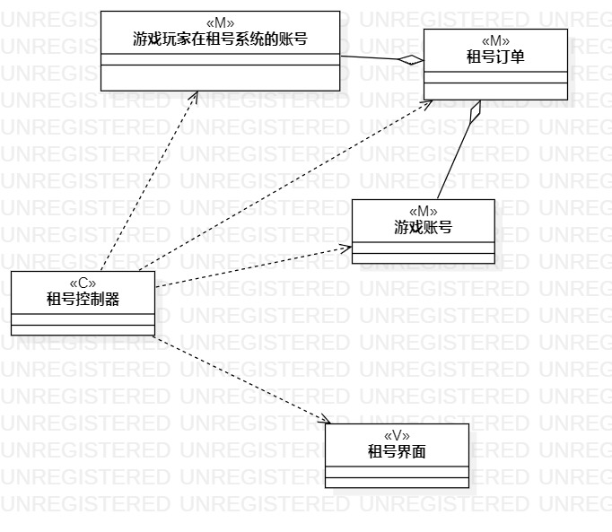
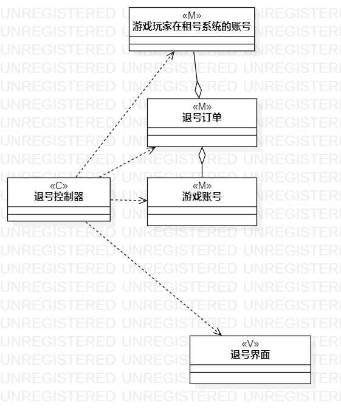

# 实验四 类建模
# 实验五 高级类建模

## 一、实验目标

1. 掌握类的概念和构成  
2. 掌握类建模方法  
3. 了解MVC设计模式  
4. 理解类的五种关系  
5. 掌握类之间关系的画法  

## 二、实验内容

1. 基于MVC模式设计类；
2. 设计类的关系；
3. 画出类图。 

## 三、实验步骤

1. 确定使用MVC设计模式
2. 通过用例规约找出类、界面和控制器
3. 在StarUML中创建类图
4. 根据MVC设计模式确定类的关系 

## 四、实验结果

  
图一.租号类图

  
图二.退号类图
