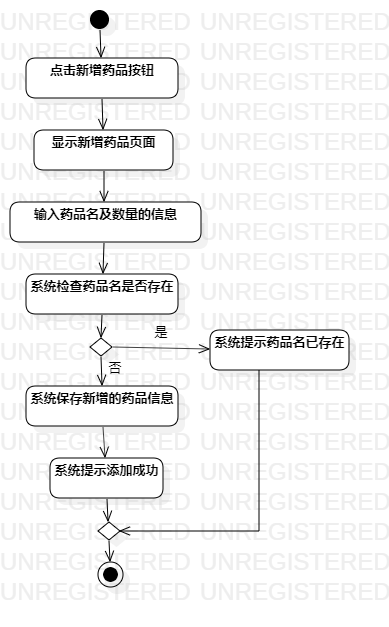
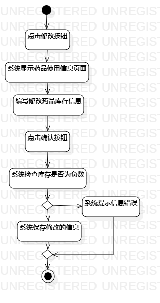

# 实验三：过程建模

## 一、实验目标

1. 掌握过程建模方法
2. 掌握活动图的画法

## 二、实验内容

   根据实验二中的用例规约创建活动图

## 三、实验步骤

1. 熟悉活动图（Activity Diagram）的符号及其用法
2. 在StarUML创建Activity Diagram
3. 添加Initial
4. 根据用例规约添加Action和Decision
5. 最后用Control Flow将各符号连接
6. 添加Final
7. 调节符号直接的间距与比例，完善活动图。

## 四、实验结果

