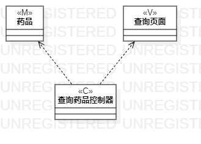
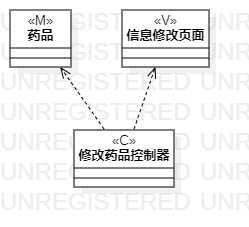

# 实验四、五：类建模与高级类建模

## 一、实验目标

1. 掌握类建模方法；

2. 了解MVC设计模式；

3. 掌握类的五种关系；

4. 掌握类图的画法。

## 二、实验内容

1. 基于MVC模式设计类；

2. 设计类的关系；

3. 画出类图。

## 三、实验步骤

1. 根据用例规约中的基本流程和扩展流程中寻找类：
 
2. 根据“查询药品”用例，设计以下类：

 * Model：药品名称、药品信息；

 * View：查询界面、查询结果界面；

 * Control：查询药品控制器。
 
3. 根据“更新药品”用例，设计以下类：

 * Model：药品库存、药品信息；

 * View：修改界面、修改成功界面、信息错误界面；

 * Control：更新药品控制器。

4. 根据MVC模式分别创建他们之间的依赖关系和包含关系

5. 完成类图的设计、编写实验报告并提交。

## 四、实验结果

  
图1：查询药品类图

  
图2：更新药品类图
