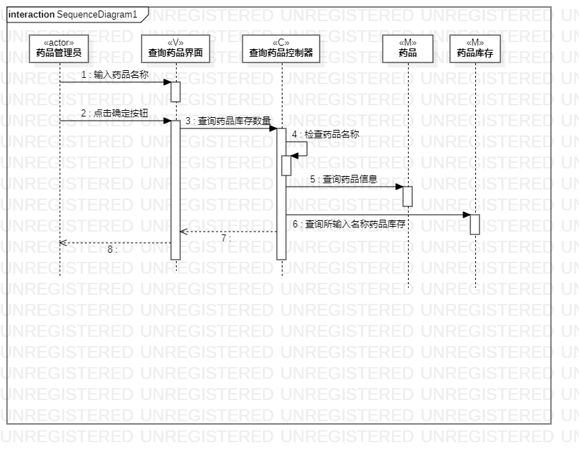

# 实验六：交互建模

## 一、实验目标

1. 理解系统交互

2. 掌握UML顺序图的画法

3. 掌握对象交互的定义与建模方法

## 二、实验内容

1. 根据用例模型和类模型，确定功能所涉及的系统对象

2. 在顺序图上画出参与者（对象）

3. 在顺序图上画出消息（交互）

## 三、实验步骤

1.  创建“查询药品”的顺序图
2.  根据类图创建（4+1）参与者：
* 药品管理员（actor)  
* 药品（M）
* 药品库存（M）
* 查询药品界面（V）  
* 查询药品控制器（C） 
3.  根据活动图找出操作流程

4.  创建“修改药品”的顺序图

5.  根据类图创建（4+1）参与者：  
* 药品管理员（actor)  
* 药品（M）
* 药品库存（M） 
* 修改药品界面（V）   
* 修改药品控制器（C）   

6.  然后同样根据活动图找出操作流程，在顺序图画出参与者之间的联系

7. 修改完善前几次实验

## 四、实验结果

  
图1：查询药品顺序图

  
图2：修改药品顺序图
