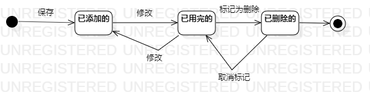

# 实验七：状态建模

## 一、实验目标

1. 掌握对象状态建模；

2. 掌握用StartUML创建状态图的方法

## 二、实验内容

1. 创建状态图

2. 编写实验报告文档

## 三、实验步骤

1. 找到“药品”这一个对象

2. 设计这个对象的关键状态
 
3. 画出状态之间的转变条件

4. 导出状态图

5. 撰写实验七文档

## 四、实验结果

   
图1：药品状态图			
