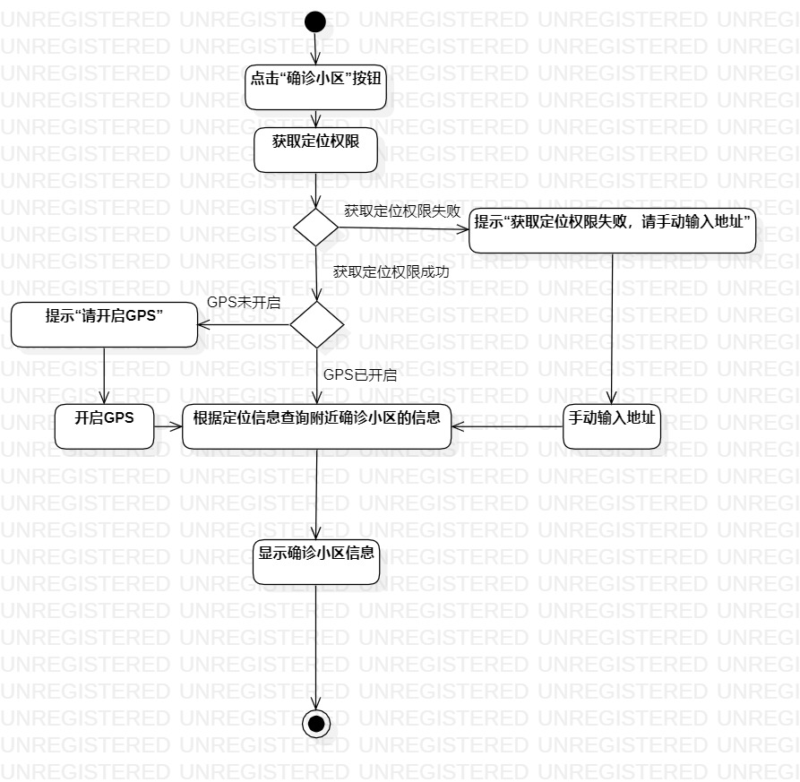
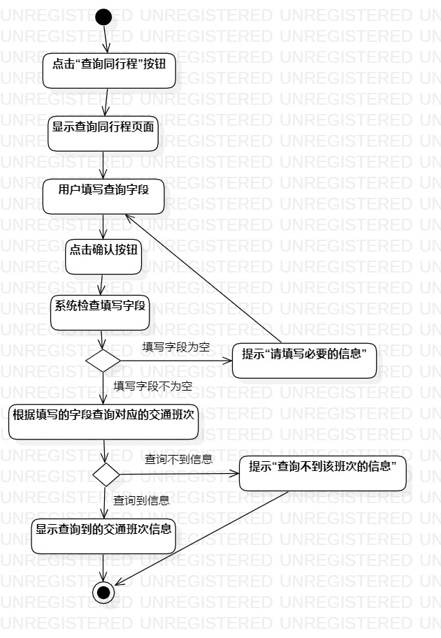
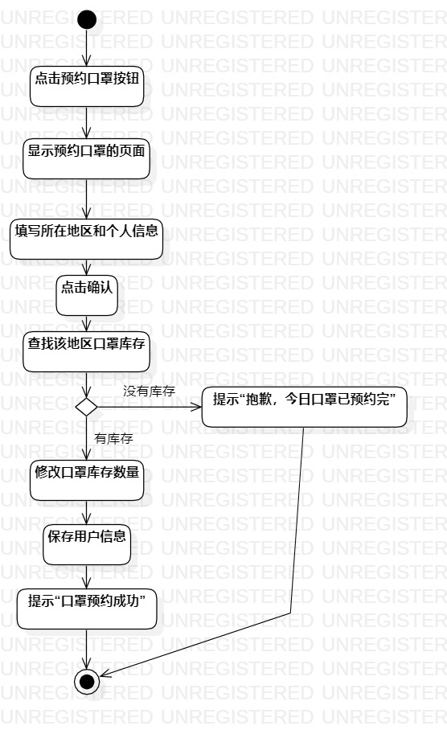

# 实验三：过程建模

## 一、实验目标

1.掌握过程建模方法；

2.掌握活动图(Activity Diagram)的画法。

## 二、实验内容

1.根据用例规约画出活动图；

2.编写实验报告。

##  三、实验步骤

1.对用例规约进行修改和完善；

2.根据用例规约来画活动图；

3.添加一个初始节点和结束节点；

4.添加活动(Action)；

5.添加决策分支(Decision)；

6.使用Control flow连接各个部分，在计策分支的Control flow上加入具体的条件；

7.完成所有的用例对应的活动图

## 四、实验结果

图1：查询确诊小区活动图

图2：查询同行程活动图

图3：预约口罩活动图
