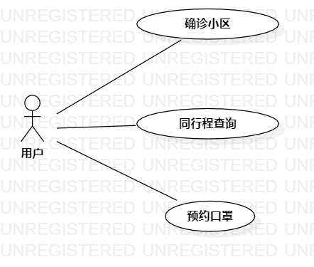

# 实验二：用例建模

## 1.实验目标

- 熟悉Git的使用
- 使用startUml建模画用例图

## 2.实验内容
- 创建选题
- 根据选题画用例图
- 上传用例图并编写报告

## 3.实验步骤
- 在issue中创建自己的选题：疫情查看小助手
- 在StartUML中
  - 建立一个用户（Actor）
  - 建立三个用例（UserCase）：（1）查询确诊小区；（2）查询同行程；（3）预约口罩
  - 建立用户与用例之间的联系。
- 编写三个用例的用例规范

## 4.实验结果

图1：疫情查看小程序的用例图

## 表一：查询确诊小区用例规范
用例编号  | UC01 | 备注  
-|:-|-  
用例名称  | 查询确诊小区  |   
前置条件  |  用户进入”疫情查看小程序“的页面    | *可选*   
后置条件  |      | *可选*   
基本流程  |1.用户点击“确诊小区”按钮  |*用例执行成功的步骤*    
~| 2. 系统请求定位权限  |   
~| 3. 用户允许系统获取定位权限  |   
~| 4. 系统根据定位信息查询附近确诊的小区信息  |   
~| 5. 系统显示确诊小区的信息（小区地址和名字）  |  
扩展流程  | 3.1 用户拒绝系统获取定位信息，显示“获取定位权限失败，请手动输入地址” |*用例执行失败*    
~| 3.2 系统无法获取定位信息，显示“请检查GPS是否开启”。 |*用例执行失败*    
## 表二：查询同行程用例规范
用例编号  | UC02 | 备注  
-|:-|-  
用例名称  | 查询同行程  |   
前置条件  | 用户进入”疫情查看小程序“的页面   | *可选*   
后置条件  |      | *可选*   
基本流程  |1.用户点击“查询同行程”按钮  |*用例执行成功的步骤*    
~| 2. 系统显示行程查询页面  |   
~| 3. 用户填写“查询地区”，“交通方式”，“航班号/车次”，“选择日期区间”等字段 |   
~| 4. 用户点击“确认”按钮  | 
~| 5. 系统根据填写的字段查询对应的交通班次  |   
~| 6. 系统显示查询到的交通班次的信息  |  
扩展流程  | 3.1 系统检测到填写字段全为空，显示“请填写必要的信息” |*用例执行失败*
~| 5.1 系统查询不到有效信息，显示“查询不到该班次信息” |*用例执行失败*    
## 表三：预约口罩用例规范
用例编号  | UC03 | 备注  
-|:-|-  
用例名称  | 预约口罩  |   
前置条件  | 用户进入”疫情查看小程序“的页面    | *可选*   
后置条件  |      | *可选*   
基本流程  |1.用户点击“预约口罩”按钮  |*用例执行成功的步骤*    
~| 2. 系统显示口罩预约的页面  |   
~| 3. 用户填写所在地区和个人信息  |   
~| 4. 用户点击“确认”按钮  | 
~| 5. 系统检查输入的信息  | 
~| 6. 系统根据信息查找到该地区还有口罩库存，修改口罩库存数量，保存用户输入的信息，生成预约订单  |   
~| 7. 系统显示预约订单信息  |  
扩展流程  | 5.1 系统检查到输入的信息为空，提示“输入信息不能为空” |*用例执行失败*    
~| 6.1 系统查找到该地区没有口罩库存，显示“抱歉，今日口罩已预约完”。 |*用例执行失败*   
