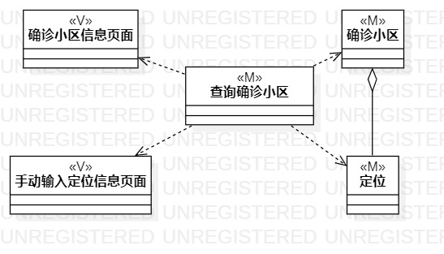
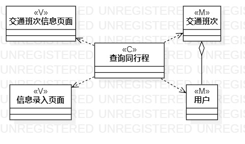
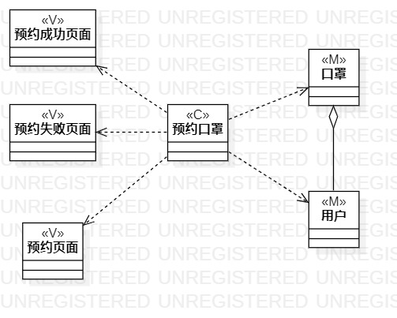

# 实验4&5

## 一、实验目标

1. 掌握类建模方法；
2. 了解MVC或你熟悉的设计模式；
3. 掌握类图的画法。（Class Diagram）

## 二、实验内容

1. 基于MVC模式设计类；
2. 设计类的关系；
3. 画出类图

## 三、实验步骤

1. 查看之前用户规约，确定自己各功能需要用到的类，采用MVC模式设计。
2. 根据每一个功能的用例规约，画出相应的类图。
3. 确定每个类之间的联系，是依赖（Dependency）还是聚合(Aggregation)。
4. 检查类图是否符合用例规约，符合设计。
5. 编写实验报告

## 四、实验结果
  
图1.查询确诊小区类图

   
图2.查询同行程类图

  
图3.预约口罩类图
